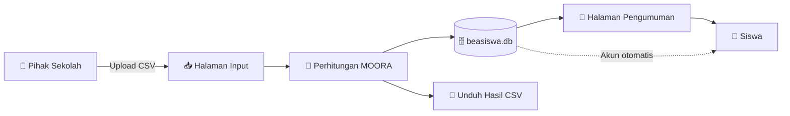
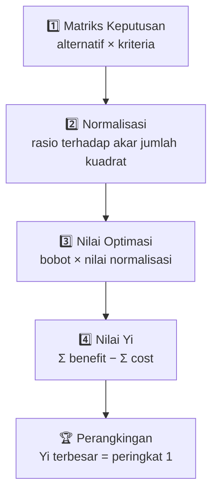
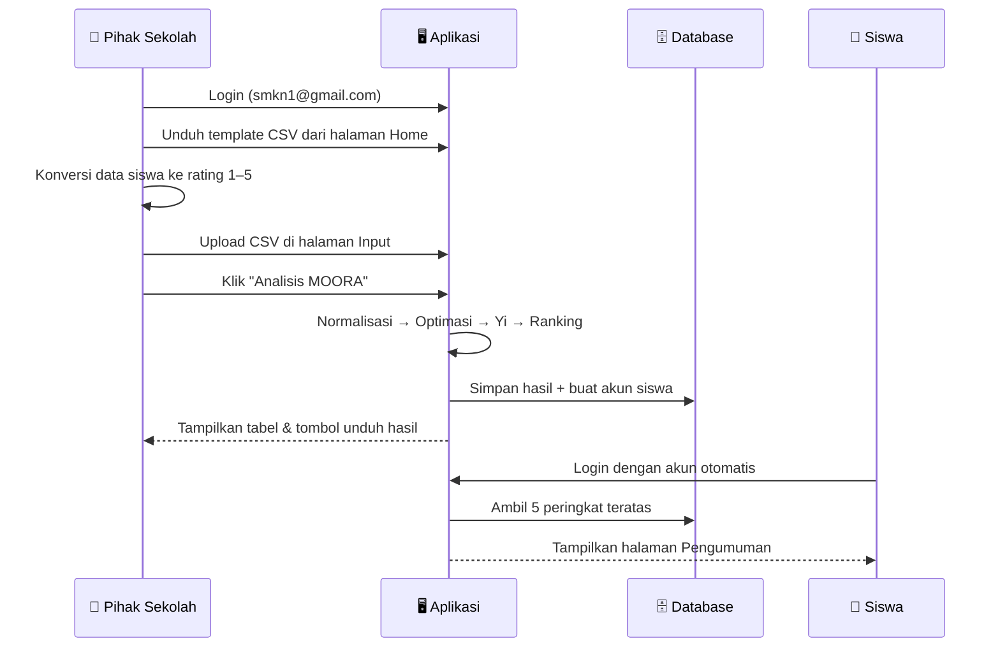

<div align="center">

# 🎓 SPK Beasiswa — Metode MOORA

**Sistem Pendukung Keputusan berbasis web untuk seleksi penerima beasiswa**
<br/>
SMK Negeri 1 Ciomas, Kabupaten Bogor

<br/>

[](https://www.python.org/)
[](https://streamlit.io/)
[](https://www.sqlite.org/)
[](https://pandas.pydata.org/)

[](https://codespaces.new/Almasyriqi/spk-beasiswa)


</div>

---

## 📑 Daftar Isi

| | |
|---|---|
| [✨ Tentang Proyek](#-tentang-proyek) | [🧮 Metode MOORA](#-metode-moora) |
| [🚀 Fitur](#-fitur) | [📊 Kriteria Penilaian](#-kriteria-penilaian) |
| [🛠️ Teknologi](#️-teknologi) | [📥 Format File Input](#-format-file-input) |
| [📂 Struktur Proyek](#-struktur-proyek) | [🗄️ Skema Database](#️-skema-database) |
| [📚 Dokumentasi](#-dokumentasi) | [📖 Panduan Penggunaan](#-panduan-penggunaan) |
| [⚡ Instalasi & Menjalankan](#-instalasi--menjalankan) | [📌 Catatan Pengembangan](#-catatan-pengembangan) |
| [🔑 Akun Login](#-akun-login) | [👥 Tim Pengembang](#-tim-pengembang) |

---

## ✨ Tentang Proyek

Pemberian beasiswa yang dilakukan secara manual sering kali memakan waktu dan rentan
terhadap subjektivitas. Aplikasi ini hadir sebagai **Sistem Pendukung Keputusan (SPK)**
yang membantu pihak sekolah menentukan penerima beasiswa secara **objektif, cepat, dan
terukur** menggunakan metode **MOORA** *(Multi-Objective Optimization on the basis of
Ratio Analysis)*.

Pihak sekolah cukup mengunggah data calon penerima dalam format CSV — sistem akan
menghitung normalisasi, nilai optimasi, dan perangkingan secara otomatis, lalu
mempublikasikan hasilnya pada halaman pengumuman yang dapat diakses oleh siswa.



---

## 🚀 Fitur

| | Fitur | Keterangan |
|:--:|---|---|
| 🔐 | **Autentikasi Multi-Peran** | Login terpisah untuk peran pihak sekolah (`admin`) dan `siswa` dengan menu yang menyesuaikan hak akses |
| 📤 | **Upload Data CSV** | Unggah data calon penerima beasiswa langsung dari berkas CSV |
| 🧮 | **Perhitungan MOORA Otomatis** | Normalisasi matriks, nilai optimasi (w × r), perhitungan Yi, hingga perangkingan |
| 📊 | **Tabel Perhitungan Transparan** | Setiap tahap perhitungan ditampilkan sehingga hasil dapat ditelusuri |
| 🧾 | **Kriteria Dinamis** | Jumlah kriteria dapat ditambah atau dikurangi langsung dari berkas CSV |
| ⚖️ | **Atribut Benefit & Cost** | Mendukung kriteria yang semakin tinggi semakin baik (*benefit*) maupun sebaliknya (*cost*) |
| 👤 | **Registrasi Akun Otomatis** | Akun siswa dibuat otomatis saat data alternatif diunggah — tanpa duplikasi |
| 📢 | **Halaman Pengumuman** | Menampilkan 5 peringkat teratas sebagai penerima beasiswa |
| 💾 | **Ekspor Hasil** | Unduh hasil perangkingan sebagai berkas CSV |
| 🔑 | **Ubah Password** | Setiap pengguna dapat memperbarui password miliknya |
| 🌙 | **Tema Gelap** | Tampilan *dark mode* aktif secara bawaan lewat `.streamlit/config.toml` |
| 🐳 | **Dev Container** | Siap dijalankan di GitHub Codespaces / VS Code Dev Containers tanpa setup manual |

---

## 🛠️ Teknologi

<div align="center">

| Komponen | Teknologi |
|---|---|
| 🖥️ **Frontend & Backend** | [Streamlit](https://streamlit.io/) `1.10.0` |
| 🧭 **Navigasi Sidebar** | [streamlit-option-menu](https://pypi.org/project/streamlit-option-menu/) `0.3.2` |
| 🔢 **Komputasi Numerik** | NumPy |
| 🐼 **Manipulasi Data** | pandas |
| 🗄️ **Basis Data** | SQLite 3 (`sqlite3` bawaan Python) |
| 🐳 **Lingkungan Pengembangan** | Dev Container (Python 3.11 Bookworm) |

</div>

---

## 📂 Struktur Proyek

```
spk-beasiswa/
├── 📄 main.py                   # Entry point: autentikasi, routing sidebar, halaman input & pengumuman
├── 📄 home.py                   # Halaman home untuk peran sekolah & siswa + tabel referensi kriteria
├── 📄 moora.py                  # Implementasi inti metode MOORA (normalisasi → optimasi → ranking)
├── 🗄️ beasiswa.db              # Basis data SQLite (tabel `users` & `hasil`)
├── 📊 template.csv              # Template berkas input beserta contoh data alternatif
├── 📦 requirements.txt          # Daftar dependency Python
├── 📚 docs/
│   ├── README.md                # Indeks dokumentasi
│   ├── MANUAL.md                # Buku panduan pemakaian bergambar
│   ├── img/                     # Screenshot untuk manual (21 berkas)
│   ├── SRS.md                   # Spesifikasi kebutuhan perangkat lunak (IEEE 830-1998)
│   ├── FITUR.md                 # Daftar fitur, status implementasi, dan roadmap
│   └── FLOWMAP.md               # Flowmap dokumen dan flowchart setiap proses
├── 🛠️ tools/
│   ├── capture_manual.py        # Pengambil screenshot otomatis (Playwright)
│   └── README.md                # Cara menjalankannya
├── ⚙️ .streamlit/
│   └── config.toml             # Konfigurasi tema aplikasi (dark mode)
└── 🐳 .devcontainer/
    └── devcontainer.json       # Konfigurasi Codespaces / Dev Container (port 8501)
```

---

## 📚 Dokumentasi

Dokumentasi teknis lengkap tersedia pada folder [`docs/`](docs/):

| Dokumen | Isi |
|---|---|
| **[📋 SRS](docs/SRS.md)** | Spesifikasi Kebutuhan Perangkat Lunak (IEEE 830-1998) — kebutuhan fungsional & non-fungsional, kebutuhan data, matriks keterlacakan |
| **[🚀 Daftar Fitur](docs/FITUR.md)** | 17 fitur ber-ID dengan status implementasi, cara pakai, keterbatasan, dan roadmap |
| **[📖 Manual Book](docs/MANUAL.md)** | Panduan pemakaian bergambar — 21 screenshot aplikasi, langkah demi langkah untuk pihak sekolah dan siswa |
| **[🗺️ Flowmap](docs/FLOWMAP.md)** | Flowmap dokumen bergaya *swimlane*, empat flowchart proses, dan diagram sekuens sistem |
| **[📚 Indeks](docs/README.md)** | Panduan navigasi dan sistem penomoran dokumentasi |

> 🔍 Setiap kebutuhan dan fitur dilengkapi rujukan `berkas:baris`, sehingga kesesuaian dokumen dengan kode dapat diperiksa langsung.

---

## 🧮 Metode MOORA

**MOORA** menyelesaikan persoalan pengambilan keputusan multi-kriteria melalui empat tahap berikut.



<table>
<tr><th>Tahap</th><th>Rumus</th><th>Penjelasan</th></tr>
<tr>
<td><b>1. Matriks Keputusan</b></td>
<td><code>X = [x<sub>ij</sub>]</code></td>
<td>Nilai alternatif <i>i</i> pada kriteria <i>j</i>, hasil konversi ke rating kecocokan 1–5.</td>
</tr>
<tr>
<td><b>2. Normalisasi</b></td>
<td><code>r<sub>ij</sub> = x<sub>ij</sub> / √(Σ x<sub>ij</sub>²)</code></td>
<td>Menyetarakan satuan antar kriteria agar dapat diperbandingkan.</td>
</tr>
<tr>
<td><b>3. Nilai Optimasi</b></td>
<td><code>v<sub>ij</sub> = w<sub>j</sub> × r<sub>ij</sub></code></td>
<td>Memberi bobot sesuai tingkat kepentingan tiap kriteria.</td>
</tr>
<tr>
<td><b>4. Nilai Akhir (Yi)</b></td>
<td><code>Y<sub>i</sub> = Σ v<sub>ij</sub><sup>(benefit)</sup> − Σ v<sub>ij</sub><sup>(cost)</sup></code></td>
<td>Alternatif dengan <code>Yi</code> terbesar menempati peringkat teratas.</td>
</tr>
</table>

> 💡 **Benefit vs Cost** — Atribut **benefit** (`1`) berarti *semakin tinggi semakin baik*,
> misalnya nilai rapor. Atribut **cost** (`0`) berarti *semakin rendah semakin baik*,
> misalnya penghasilan orang tua.

---

## 📊 Kriteria Penilaian

### 🎯 Daftar Kriteria, Bobot & Atribut

| Kode | Kriteria | Bobot | Atribut | Kode CSV |
|:----:|---|:-----:|:-------:|:--------:|
| **C1** | Surat Keterangan Tidak Mampu (SKTM) | `4` | 🟢 Benefit | `1` |
| **C2** | Status Anak Dalam Keluarga (SADK) | `5` | 🔴 Cost | `0` |
| **C3** | Penghasilan Orang Tua (PO) | `3` | 🔴 Cost | `0` |
| **C4** | Jumlah Tanggungan Orang Tua (JTO) | `3` | 🟢 Benefit | `1` |
| **C5** | Nilai Rata-Rata Rapor Semester Terakhir (NRRST) | `1` | 🟢 Benefit | `1` |

### ⚖️ Skala Tingkat Kepentingan (Bobot) & Rating Kecocokan

| Nilai | Tingkat Kepentingan | Rating Kecocokan |
|:-----:|---|---|
| `1` | Sangat Rendah (SR) | Sangat Buruk (SB) |
| `2` | Rendah (R) | Buruk (B) |
| `3` | Cukup (C) | Cukup (C) |
| `4` | Tinggi (T) | Baik (T) |
| `5` | Sangat Tinggi (ST) | Sangat Baik (ST) |

<details>
<summary>📋 <b>Contoh konversi data siswa ke rating kecocokan</b></summary>

<br/>

| Nama | SKTM | SADK | Penghasilan Orang Tua | JTO | NRRST |
|---|---|---|---|:---:|:---:|
| Abdul Hakim | Ada | Yatim | 1.000.000 < X ≤ 2.000.000 | 3 | 80.83 |
| Adi Wiguna | Tidak | Yatim | 2.000.000 < X ≤ 4.000.000 | 2 | 82.08 |
| Ahmad Zaelani | Ada | Orangtua lengkap | 1.000.000 < X ≤ 2.000.000 | 3 | 80.66 |
| Desi Ismiyati | Ada | Orangtua lengkap | 1.000.000 < X ≤ 2.000.000 | 4 | 78.09 |
| Dimas Permana | Ada | Yatim Piatu | X ≤ 1.000.000 | 3 | 79.18 |

⬇️ dikonversikan menjadi ⬇️

| Alternatif | C1 | C2 | C3 | C4 | C5 |
|---|:--:|:--:|:--:|:--:|:--:|
| Abdul Hakim | 5 | 3 | 3 | 3 | 4 |
| Adi Wiguna | 1 | 3 | 5 | 2 | 4 |
| Ahmad Zaelani | 5 | 5 | 3 | 3 | 4 |
| Desi Ismiyati | 5 | 5 | 3 | 4 | 3 |
| Dimas Permana | 5 | 2 | 2 | 3 | 3 |

Tabel referensi lengkap (Tabel 1–6) tersedia pada **halaman Home** setelah login sebagai pihak sekolah.

</details>

---

## ⚡ Instalasi & Menjalankan

### 📋 Prasyarat

| | Kebutuhan |
|:--:|---|
| 🐍 | **Python 3.7 – 3.10** |
| 📦 | **PIP** (pengelola paket Python) |
| 🧪 | **Virtual environment** — `venv`, `pipenv`, atau `conda` |
| 📝 | **Text editor / IDE** — VS Code, PyCharm, dsb. |

<br/>

### 🅰️ Opsi 1 — Jalankan Secara Lokal

**1. Kloning repositori**

```bash
git clone https://github.com/Almasyriqi/spk-beasiswa.git
cd spk-beasiswa
```

**2. Siapkan virtual environment**

<details open>
<summary>🐍 <b>venv</b> (bawaan Python)</summary>

```bash
# Linux / macOS
python -m venv venv
source venv/bin/activate

# Windows
python -m venv venv
venv\Scripts\activate
```

</details>

<details>
<summary>🅒 <b>Conda / Anaconda</b></summary>

```bash
conda create -n spk-beasiswa python=3.10
conda activate spk-beasiswa
```

> Pada Windows, jalankan perintah di atas melalui **Anaconda Prompt**.

</details>

**3. Instal dependency**

```bash
pip install -r requirements.txt
```

**4. Jalankan aplikasi**

```bash
streamlit run main.py
```

**5. Buka di browser** 👉 [http://localhost:8501](http://localhost:8501)

<br/>

### 🅱️ Opsi 2 — GitHub Codespaces / Dev Container

Repositori ini sudah dilengkapi `.devcontainer/devcontainer.json`, sehingga dependency
terinstal otomatis dan aplikasi langsung berjalan pada port **8501**.

[](https://codespaces.new/Almasyriqi/spk-beasiswa)

> Alternatif: di VS Code, jalankan **Dev Containers: Reopen in Container** dari Command Palette.

---

## 🔑 Akun Login

### 🏫 Akun Pihak Sekolah

```text
Email    : smkn1@gmail.com
Password : 12345678
```

### 🎒 Akun Siswa

Akun siswa **terbentuk otomatis** ketika pihak sekolah mengunggah data alternatif dan
menekan tombol **Analisis MOORA**. Aturan pembentukannya:

| Komponen | Aturan | Contoh |
|---|---|---|
| 📧 **Email** | Dua kata pertama nama, digabung tanpa spasi + `@gmail.com` | `Abdul Hakim` → `AbdulHakim@gmail.com` |
| 🔒 **Password** | Selalu `1234` | `1234` |
| 🏷️ **Role** | Selalu `siswa` | `siswa` |

> ⚠️ Nama yang hanya terdiri dari satu kata akan menghasilkan email seperti
> `Abdul@gmail.com`. Akun dengan email yang sudah terdaftar tidak akan diduplikasi.

---

## 📥 Format File Input

Berkas CSV wajib mengikuti struktur **tiga bagian** berikut — sesuai `template.csv`:

```csv
Kriteria,C1,C2,C3,C4,C5
Atribut,1,0,0,1,1
Bobot,4,5,3,3,1
Abdul Hakim,5,3,3,3,4
Adi Wiguna,1,3,5,2,4
Ahmad Zaelani,5,5,3,3,4
```

| Baris | Isi | Aturan |
|:--:|---|---|
| **1** | 🏷️ Header kriteria | Kolom pertama `Kriteria`, diikuti kode kriteria (`C1`, `C2`, …) |
| **2** | ⚖️ Atribut | `1` = **benefit**, `0` = **cost** |
| **3** | 🎚️ Bobot | Angka `1` – `5` sesuai tingkat kepentingan |
| **4+** | 👥 Alternatif | Nama siswa + nilai rating kecocokan (`1` – `5`) per kriteria |

> 🧩 **Kriteria dinamis** — kolom kriteria dapat ditambah atau dikurangi sesuai kebutuhan,
> selama baris *Atribut* dan *Bobot* turut disesuaikan.

> ⚠️ **Penting** — jangan mengosongkan sel, mengubah urutan baris, atau mengisi nilai di
> luar aturan di atas. Struktur yang tidak sesuai akan menyebabkan error pada perhitungan.

Template dapat diunduh langsung dari **halaman Home** (tombol *Download Template CSV*).

---

## 🗄️ Skema Database

Aplikasi menggunakan **SQLite** dengan berkas `beasiswa.db` dan dua tabel:

<table>
<tr><td valign="top" width="50%">

**👤 `users`** — data akun pengguna

| Kolom | Tipe | Keterangan |
|---|---|---|
| `id` | INTEGER | PK, auto increment |
| `username` | TEXT | Nama pengguna |
| `email` | TEXT | Email untuk login |
| `password` | TEXT | Password |
| `role` | TEXT | `admin` (sekolah) \| `siswa` |

</td><td valign="top" width="50%">

**🏆 `hasil`** — hasil perangkingan MOORA

| Kolom | Tipe | Keterangan |
|---|---|---|
| `id` | INTEGER | PK, auto increment |
| `nama` | TEXT | Nama alternatif |
| `nilai` | REAL | Nilai optimasi `Yi` |
| `ranking` | INTEGER | Peringkat hasil seleksi |

</td></tr>
</table>

> 🔄 Tabel `hasil` **selalu ditulis ulang** setiap kali analisis MOORA dijalankan, sehingga
> halaman pengumuman hanya menampilkan hasil seleksi terbaru.

---

## 📖 Panduan Penggunaan



### 🏫 Sebagai Pihak Sekolah

| Langkah | Aksi |
|:--:|---|
| **1** | Login menggunakan akun pihak sekolah |
| **2** | Pada menu **Home**, pelajari Tabel 1–6 lalu klik **Download Template CSV** |
| **3** | Konversi data calon penerima ke rating kecocokan `1` – `5`, lengkapi baris *Atribut* & *Bobot* |
| **4** | Buka menu **Input**, unggah berkas CSV yang sudah diisi |
| **5** | Klik **Analisis MOORA** — sistem menampilkan normalisasi, nilai optimasi, dan perangkingan |
| **6** | Klik **Download Hasil CSV** untuk menyimpan hasil, atau buka **Pengumuman** untuk melihat 5 peringkat teratas |

### 🎒 Sebagai Siswa

| Langkah | Aksi |
|:--:|---|
| **1** | Login dengan email & password otomatis (lihat [🔑 Akun Login](#-akun-login)) |
| **2** | Buka menu **Pengumuman** untuk melihat daftar penerima beasiswa |
| **3** | Gunakan menu **Edit Password** untuk mengganti password bawaan |

### 🧭 Ringkasan Menu per Peran

| Menu | 🏫 Sekolah | 🎒 Siswa |
|---|:--:|:--:|
| 🏠 Home | ✅ | ✅ |
| 📥 Input | ✅ | — |
| 📢 Pengumuman | ✅ | ✅ |
| 🔑 Edit Password | ✅ | ✅ |

---

## 👥 Tim Pengembang

<div align="center">

| NIM | Nama | GitHub |
|:---:|---|:---:|
| `1941720057` | Muhammad Syifa'ul Ikrom Almasyriqi | [](https://github.com/Almasyriqi) |
| `1841720163` | Rakha Elang Gunawan | [](https://github.com/rakhaegg) |

</div>

---

## 📌 Catatan Pengembangan

- 👤 Peran pihak sekolah tersimpan dengan nilai `admin`; setiap peran selain `siswa` diperlakukan sebagai pihak sekolah.
- 🔐 Password masih disimpan sebagai teks biasa — gunakan *hashing* (mis. `bcrypt`) untuk penggunaan produksi.
- 🗄️ Berkas `beasiswa.db` ikut ter-*commit* pada repositori agar aplikasi dapat langsung dicoba.
- 📢 Halaman pengumuman menampilkan **5 peringkat teratas**; jumlah ini dapat diubah pada `main.py`.
- 🧪 Proyek ini dikembangkan sebagai tugas akademik, sehingga masih terbuka untuk pengembangan lanjutan.

---

<div align="center">

**⭐ Jika proyek ini bermanfaat, jangan lupa beri bintang pada repositori ini!**

<sub>Dibuat untuk SMK Negeri 1 Ciomas, Kabupaten Bogor</sub>

</div>
