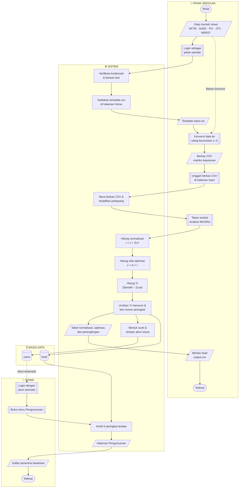
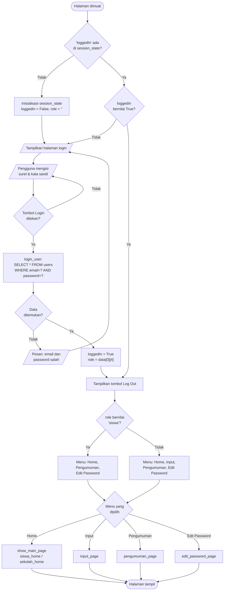
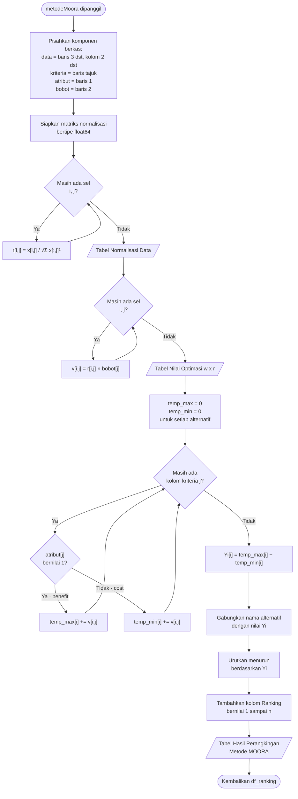
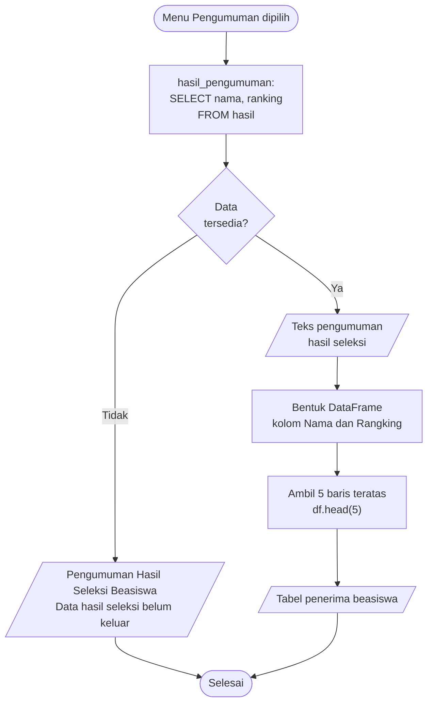
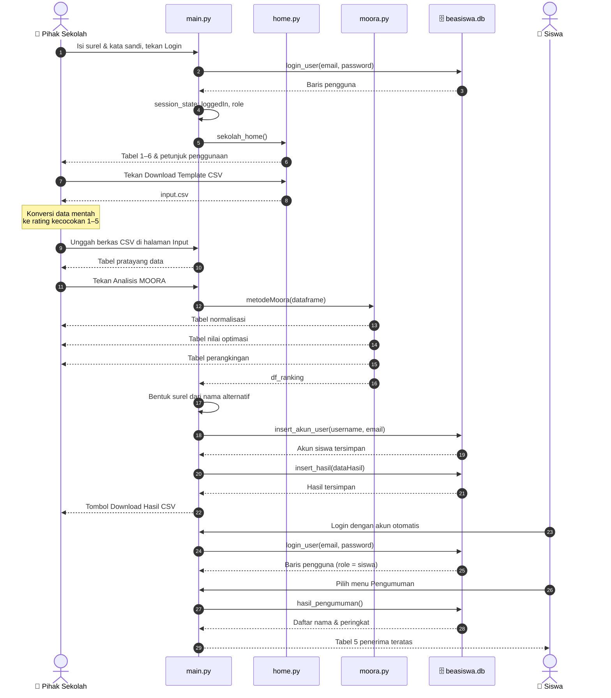

# 🗺️ Flowmap & Flowchart

### SPK Beasiswa — Metode MOORA
**SMK Negeri 1 Ciomas, Kabupaten Bogor**

 

---

## 📑 Daftar Isi

| Bagian | Isi |
|---|---|
| **A** | [Keterangan Simbol](#a-keterangan-simbol) |
| **B** | [Flowmap Dokumen (Swimlane)](#b-flowmap-dokumen-swimlane) |
| **C** | [Narasi Alur per Langkah](#c-narasi-alur-per-langkah) |
| **D** | [Flowchart 1 — Autentikasi & Routing](#d-flowchart-1--autentikasi--routing-berbasis-peran) |
| **E** | [Flowchart 2 — Unggah & Analisis](#e-flowchart-2--unggah--analisis-data) |
| **F** | [Flowchart 3 — Algoritma MOORA](#f-flowchart-3--algoritma-moora) |
| **G** | [Flowchart 4 — Publikasi Pengumuman](#g-flowchart-4--publikasi-pengumuman) |
| **H** | [Diagram Sekuens Sistem](#h-diagram-sekuens-sistem) |

> 📎 **Dokumen terkait:** [SRS](SRS.md) · [Daftar Fitur](FITUR.md) · [README Proyek](../README.md)

---

# A. Keterangan Simbol

Diagram pada dokumen ini digambar dengan **Mermaid** agar ter-render langsung di GitHub. Bentuk node mengikuti konvensi flowmap dan flowchart berikut:

| Bentuk | Notasi Mermaid | Makna |
|---|---|---|
| ⬭ Kapsul | `([...])` | Terminator — awal atau akhir alur |
| ▭ Persegi | `[...]` | Proses atau aktivitas |
| ▱ Jajar genjang | `[/.../]` | Dokumen, masukan, atau keluaran |
| ◇ Belah ketupat | `{...}` | Keputusan atau percabangan |
| ⛁ Silinder | `[(...)]` | Penyimpanan data / basis data |
| ⬚ Aktivitas manual | `[[...]]` | Aktivitas manual di luar sistem |
| → Panah utuh | `-->` | Aliran kendali atau data |
| ⇢ Panah putus | `-.->` | Aliran tidak langsung atau bersifat turunan |

---

# B. Flowmap Dokumen (Swimlane)

Flowmap berikut memperlihatkan perjalanan dokumen dan data antar entitas, dari data mentah siswa sampai pengumuman diterima siswa. Setiap kolom (*swimlane*) mewakili satu entitas yang terlibat.

> 💡 Alur pada kolom **Sistem** mengikuti urutan pemanggilan fungsi sebenarnya: `login_user` → `show_sidebar` → `input_page` → `metodeMoora` → `insert_akun_user` → `insert_hasil` → `pengumuman_page`.
>
> 🔍 Diagram ini menyajikan **alur utama dokumen** tanpa percabangan, agar perjalanan berkas antar entitas mudah diikuti. Percabangan pada proses autentikasi digambarkan terpisah pada [Flowchart 1](#d-flowchart-1--autentikasi--routing-berbasis-peran).

---

# C. Narasi Alur per Langkah

Tabel berikut adalah padanan tekstual flowmap di atas — tetap terbaca apabila diagram gagal ter-render, dan berguna sebagai acuan penomoran langkah pada laporan.

| No | Entitas | Aktivitas | Dokumen masuk | Dokumen keluar |
|:--:|---|---|---|---|
| 1 | 🏫 Pihak Sekolah | Menghimpun data mentah calon penerima beasiswa | — | Data mentah siswa |
| 2 | 🏫 Pihak Sekolah | Login ke sistem | Kredensial | — |
| 3 | ⚙️ Sistem | Memverifikasi kredensial terhadap tabel `users` | Kredensial | Status sesi & peran |
| 4 | ⚙️ Sistem | Menyediakan berkas template melalui halaman Home | — | `input.csv` (template) |
| 5 | 🏫 Pihak Sekolah | Mengonversi data mentah ke rating kecocokan `1`–`5` secara manual | Data mentah, template | Berkas CSV matriks keputusan |
| 6 | 🏫 Pihak Sekolah | Mengunggah berkas CSV pada halaman Input | Berkas CSV | — |
| 7 | ⚙️ Sistem | Membaca berkas dan menampilkan pratayang data | Berkas CSV | Tabel pratayang |
| 8 | 🏫 Pihak Sekolah | Menekan tombol `Analisis MOORA` | — | Perintah analisis |
| 9 | ⚙️ Sistem | Menghitung normalisasi matriks | Matriks keputusan | Tabel normalisasi |
| 10 | ⚙️ Sistem | Menghitung nilai optimasi `v = w × r` | Matriks normalisasi | Tabel nilai optimasi |
| 11 | ⚙️ Sistem | Menghitung `Yi` sebagai selisih jumlah *benefit* dan *cost* | Matriks optimasi | Nilai `Yi` per alternatif |
| 12 | ⚙️ Sistem | Mengurutkan `Yi` menurun dan memberi nomor peringkat | Nilai `Yi` | Tabel perangkingan |
| 13 | ⚙️ Sistem | Membentuk surel dan menyimpan akun siswa yang belum terdaftar | Daftar alternatif | Baris baru pada `users` |
| 14 | ⚙️ Sistem | Mengosongkan lalu menyimpan hasil perangkingan | Tabel perangkingan | Baris pada `hasil` |
| 15 | 🏫 Pihak Sekolah | Mengunduh berkas hasil | Tabel perangkingan | `output.csv` |
| 16 | 🎒 Siswa | Login memakai akun yang terbentuk otomatis | Kredensial bawaan | Status sesi |
| 17 | ⚙️ Sistem | Mengambil lima peringkat teratas dari tabel `hasil` | Tabel `hasil` | Daftar penerima |
| 18 | 🎒 Siswa | Melihat pengumuman hasil seleksi | — | Daftar penerima beasiswa |

---

# D. Flowchart 1 — Autentikasi & Routing Berbasis Peran

Menggambarkan alur dari pemuatan halaman pertama hingga pemilihan menu, mencakup pengelolaan `st.session_state`.

> 🔖 Sumber: `main.py:83-102`, `main.py:112-135`, `main.py:189-200`

> ⚠️ Menu `Input` dipilih dengan pola *else*: setiap peran selain `siswa` memperoleh menu pihak sekolah. Lihat [SRS-F-02](SRS.md#srs-f-02--otorisasi-menu-berbasis-peran).

---

# E. Flowchart 2 — Unggah & Analisis Data

Alur pada halaman Input, dari unggahan berkas sampai hasil tersimpan dan siap diunduh.

> 🔖 Sumber: `main.py:137-161`, `main.py:28-65`

```mermaid
flowchart TD
    START([Halaman Input dibuka]) --> UPLOAD[/"Pengguna memilih<br/>berkas .csv"/]
    UPLOAD --> CEKFILE{"Berkas<br/>terunggah?"}
    CEKFILE -->|Tidak| UPLOAD
    CEKFILE -->|Ya| BACA["pd.read_csv<br/>membaca berkas"]
    BACA --> PRATAYANG[/"Tampilkan seluruh isi<br/>berkas sebagai tabel"/]
    PRATAYANG --> TOMBOL{"Tombol Analisis<br/>MOORA ditekan?"}
    TOMBOL -->|Tidak| PRATAYANG

    TOMBOL -->|Ya| MOORA["metodeMoora dataframe<br/>lihat Flowchart 3"]
    MOORA --> HASIL[/"DataFrame hasil:<br/>Alternatif, Yi, Ranking"/]

    HASIL --> AMBILALT["Ambil kolom alternatif<br/>hasil.iloc[:,0]"]
    AMBILALT --> LOOPMAIL["Untuk setiap nama:<br/>pecah berdasarkan spasi"]
    LOOPMAIL --> CEKKATA{"Jumlah kata<br/>lebih dari 1?"}
    CEKKATA -->|Ya| MAIL2["surel = kata1 + kata2<br/>+ @gmail.com"]
    CEKKATA -->|Tidak| MAIL1["surel = kata1<br/>+ @gmail.com"]
    MAIL2 --> INSERTUSER
    MAIL1 --> INSERTUSER

    INSERTUSER["insert_akun_user:<br/>baca seluruh tabel users"]
    INSERTUSER --> CEKDUP{"Surel sudah<br/>terdaftar?"}
    CEKDUP -->|Ya| SKIP["Lewati, tidak diduplikasi"]
    CEKDUP -->|Tidak| SUSUN["Susun baris akun baru<br/>password 1234, role siswa"]
    SUSUN --> SIMPANUSER[("Simpan ke tabel users")]
    SKIP --> INSERTHASIL
    SIMPANUSER --> INSERTHASIL

    INSERTHASIL["insert_hasil"]
    INSERTHASIL --> HAPUS["DELETE FROM hasil<br/>dan reset AUTOINCREMENT"]
    HAPUS --> SIMPANHASIL[("Simpan ke tabel hasil")]
    SIMPANHASIL --> CEKSIMPAN{"Penyimpanan<br/>berhasil?"}
    CEKSIMPAN -->|Tidak| PESANERR[/"Tampilkan pesan galat"/]
    CEKSIMPAN -->|Ya| PESANOK[/"Behasil Menyimpan data hasil"/]
    PESANOK --> UNDUH[/"Tombol Download Hasil CSV<br/>output.csv"/]
    PESANERR --> AKHIR
    UNDUH --> AKHIR([Selesai])
```

> ⚠️ Tidak ada tahap validasi antara `pd.read_csv` dan `metodeMoora`. Berkas dengan struktur menyimpang menimbulkan *exception* pada tahap perhitungan. Lihat [KI-03](SRS.md#51-daftar-temuan).

---

# F. Flowchart 3 — Algoritma MOORA

Alur inti perhitungan, dengan perulangan digambarkan eksplisit.

> 🔖 Sumber: `moora.py:5-54`

### Ringkasan rumus tiap tahap

| Tahap | Rumus | Baris kode |
|---|---|---|
| Normalisasi | `r_ij = x_ij / √(Σ x_ij²)` | `moora.py:14-16` |
| Nilai optimasi | `v_ij = w_j × r_ij` | `moora.py:24-26` |
| Akumulasi *benefit* | `temp_max_i = Σ v_ij` untuk `atribut_j = 1` | `moora.py:36-37` |
| Akumulasi *cost* | `temp_min_i = Σ v_ij` untuk `atribut_j = 0` | `moora.py:38-39` |
| Nilai akhir | `Y_i = temp_max_i − temp_min_i` | `moora.py:42-43` |
| Perangkingan | Urutkan `Y_i` menurun, beri peringkat `1`–`n` | `moora.py:46-49` |

> ℹ️ Pada tahap **Gabungkan**, tabel perangkingan dibentuk langsung dari kolom nama dan kolom `Yi` sehingga masing-masing mempertahankan tipe datanya. Kolom `Yi` bertipe `float64`, sehingga pengurutannya numerik. Lihat [KI-01](SRS.md#51-daftar-temuan) untuk riwayat temuan ini.

---

# G. Flowchart 4 — Publikasi Pengumuman

> 🔖 Sumber: `main.py:67-70`, `main.py:163-178`

> ℹ️ Halaman ini dapat diakses baik oleh pihak sekolah maupun siswa, dan menampilkan data yang sama bagi keduanya.

---

# H. Diagram Sekuens Sistem

Interaksi antar pelaku dan komponen sepanjang satu siklus seleksi, memakai nama fungsi sebenarnya pada kode.

---

[⬆️ Kembali ke atas](#️-flowmap--flowchart) · [📚 Indeks Dokumentasi](README.md) · [📋 SRS](SRS.md) · [🚀 Daftar Fitur](FITUR.md)

