<div align="center">

# 📖 Manual Book

### Panduan Penggunaan Sistem Pendukung Keputusan Penerimaan Beasiswa
**Metode MOORA — SMK Negeri 1 Ciomas, Kabupaten Bogor**

<br/>


</div>

---

## 📑 Daftar Isi

| | |
|---|---|
| [1. Sekilas Aplikasi](#1-sekilas-aplikasi) | [5. Panduan Siswa](#5-panduan-siswa) |
| [2. Menjalankan Aplikasi](#2-menjalankan-aplikasi) | [6. Rujukan Singkat](#6-rujukan-singkat) |
| [3. Mengenal Antarmuka](#3-mengenal-antarmuka) | [7. Penyelesaian Masalah](#7-penyelesaian-masalah) |
| [4. Panduan Pihak Sekolah](#4-panduan-pihak-sekolah) | [8. Catatan Versi](#8-catatan-versi) |

> 📎 **Dokumen terkait:** [SRS](SRS.md) · [Daftar Fitur](FITUR.md) · [Flowmap](FLOWMAP.md) · [README Proyek](../README.md)

---

# 1. Sekilas Aplikasi

Aplikasi ini membantu pihak sekolah menentukan penerima beasiswa secara objektif memakai metode **MOORA**. Pihak sekolah memasukkan data calon penerima lewat berkas CSV, sistem menghitung dan mengurutkan peringkatnya, lalu hasilnya diumumkan kepada siswa.

Ada **dua jenis pengguna** dengan menu yang berbeda:

| Pengguna | Yang dapat dilakukan |
|---|---|
| 🏫 **Pihak Sekolah** | Mengunduh template, mengunggah data, menjalankan analisis MOORA, melihat dan mengunduh hasil, melihat pengumuman, mengubah kata sandi |
| 🎒 **Siswa** | Melihat pengumuman hasil seleksi dan mengubah kata sandi |

---

# 2. Menjalankan Aplikasi

Langkah pemasangan lengkap ada di [README proyek](../README.md#-instalasi--menjalankan). Ringkasnya:

```bash
pip install -r requirements.txt
streamlit run main.py
```

Aplikasi lalu dibuka di peramban pada alamat **http://localhost:8501**.

---

# 3. Mengenal Antarmuka

Setelah masuk, layar terbagi dua bagian: **menu samping** di kiri dan **isi halaman** di kanan. Menu yang muncul menyesuaikan jenis pengguna.

<table>
<tr>
<td width="50%" valign="top" align="center">

**🏫 Menu pihak sekolah**

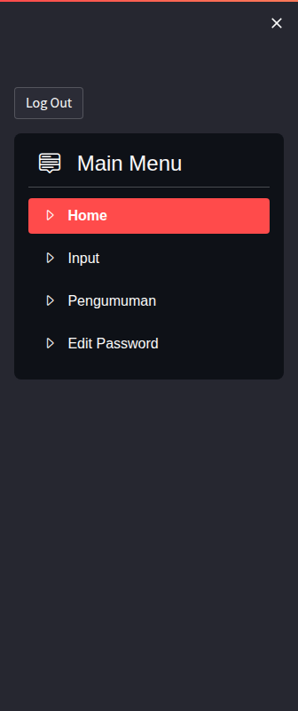

Empat menu, termasuk **Input**

</td>
<td width="50%" valign="top" align="center">

**🎒 Menu siswa**

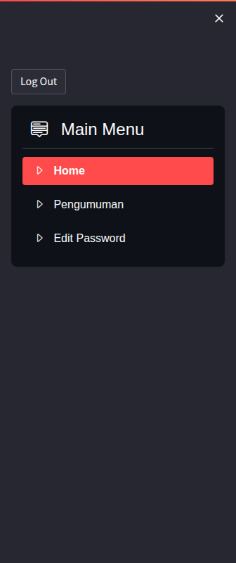

Tiga menu, **tanpa** Input

</td>
</tr>
</table>

Tombol **Log Out** selalu berada di atas menu untuk mengakhiri sesi.

---

# 4. Panduan Pihak Sekolah

## Langkah 1 · Masuk ke sistem

Buka alamat aplikasi. Halaman pertama yang muncul adalah halaman login.


Isikan surel dan kata sandi pihak sekolah:

```text
Email    : smkn1@gmail.com
Password : 12345678
```


Tekan tombol **Login**. Akan muncul pesan hijau `Logged In As SMKN1 Ciomas`, tetapi halaman **masih menampilkan formulir login**:


> ⚠️ **Penting — tekan tombol Login sekali lagi.**
> Ini bukan tanda kegagalan. Pada penekanan pertama sistem sudah mengenali akun Anda, tetapi menu samping baru muncul setelah halaman dimuat ulang. **Tekan Login sekali lagi** dan halaman utama akan terbuka. Perilaku ini tercatat sebagai temuan [KI-10](SRS.md#51-daftar-temuan).

## Langkah 2 · Pelajari halaman Home

Halaman Home memuat seluruh acuan yang diperlukan sebelum mengisi data. Bacalah bagian ini lebih dulu bila Anda baru pertama kali memakai sistem.

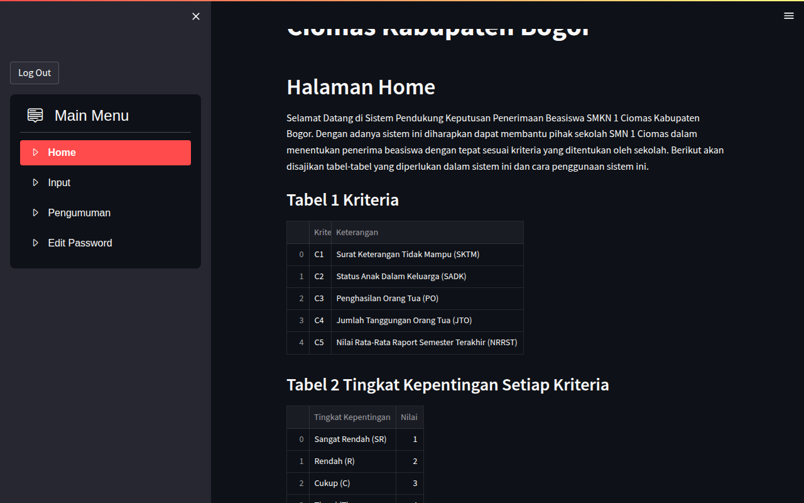

**Tabel 1** memuat lima kriteria penilaian, sedangkan **Tabel 2–4** menjelaskan skala angka yang dipakai:

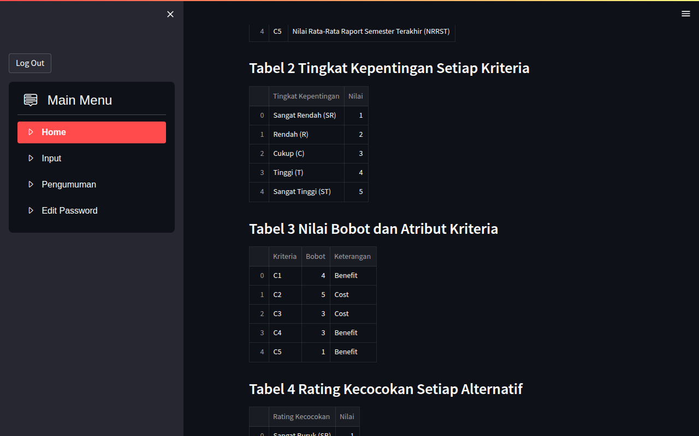

**Tabel 5 dan 6** memperlihatkan contoh nyata: data siswa apa adanya, lalu bentuknya setelah dikonversi menjadi angka 1–5. Inilah contoh yang perlu Anda tiru saat mengisi data sendiri.

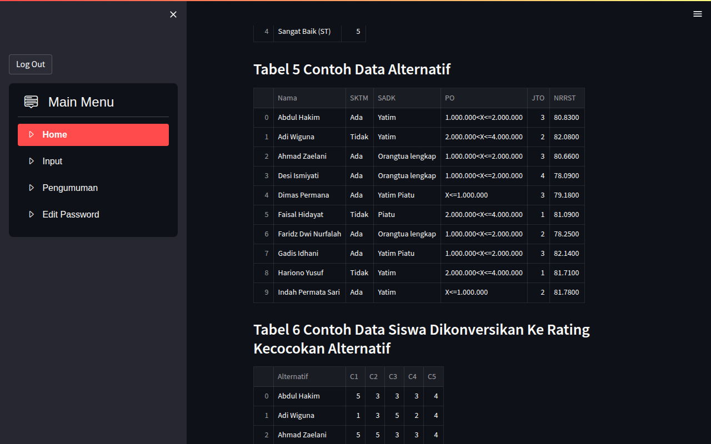

## Langkah 3 · Unduh template CSV

Di bagian bawah halaman Home terdapat petunjuk penggunaan dan tombol **Download Template CSV**.

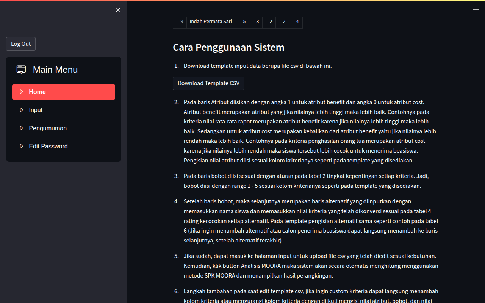

Tekan tombol tersebut. Berkas `input.csv` akan tersimpan di komputer Anda, sudah berisi contoh data yang dapat diganti.

## Langkah 4 · Isi data calon penerima

Buka berkas hasil unduhan memakai aplikasi lembar kerja atau penyunting teks. Susunannya:

| Baris | Isi | Aturan |
|:--:|---|---|
| **1** | `Kriteria`, `C1`, `C2`, … | Baris judul, boleh ditambah atau dikurangi kolomnya |
| **2** | `Atribut` | `1` untuk *benefit*, `0` untuk *cost* |
| **3** | `Bobot` | Angka `1`–`5` sesuai Tabel 2 |
| **4 dst.** | Nama siswa dan nilainya | Angka `1`–`5` sesuai Tabel 4 |

> 💡 **Benefit atau cost?** *Benefit* berarti semakin tinggi semakin baik, misalnya nilai rapor. *Cost* berarti semakin rendah semakin baik, misalnya penghasilan orang tua.

> ⚠️ Jangan mengosongkan sel mana pun dan jangan mengubah urutan tiga baris pertama. Berkas yang tidak sesuai akan menimbulkan pesan galat teknis saat dianalisis.

## Langkah 5 · Unggah berkas

Pilih menu **Input** pada menu samping.

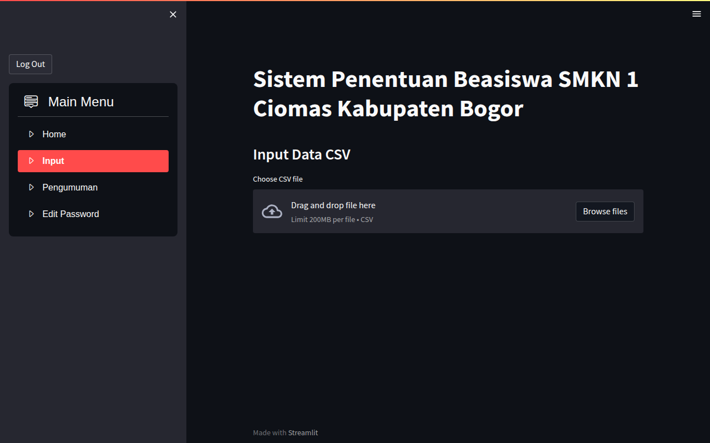

Tekan **Browse files** lalu pilih berkas CSV Anda, atau seret berkasnya langsung ke area tersebut. Setelah terunggah, isi berkas langsung ditampilkan supaya dapat diperiksa lebih dulu.

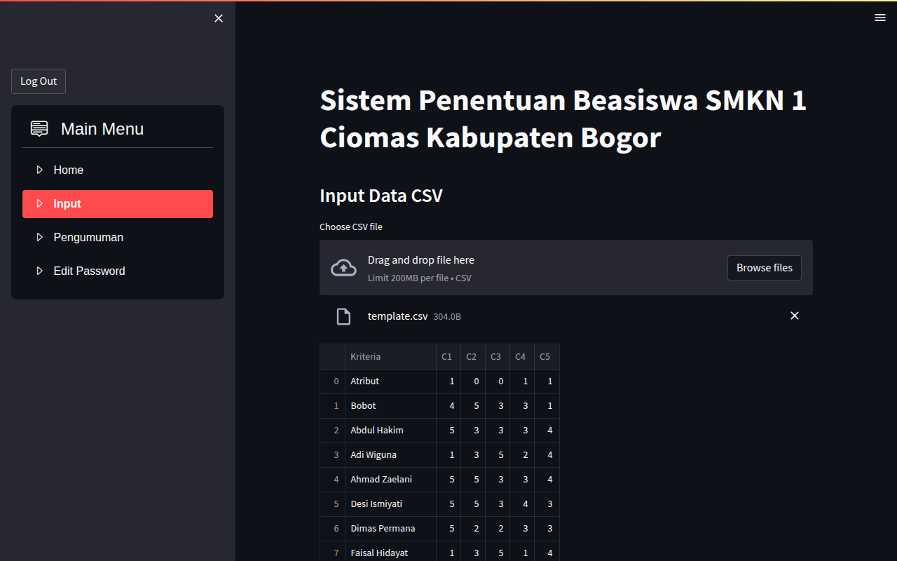

> 🔍 Periksa pratayang ini sebelum melanjutkan. Bila ada nilai yang keliru, perbaiki berkasnya lalu unggah ulang.

## Langkah 6 · Jalankan analisis MOORA

Tekan tombol **Analisis MOORA**. Sistem menampilkan setiap tahap perhitungan secara berurutan sehingga hasilnya dapat ditelusuri.

**Tahap 1 — Normalisasi.** Nilai tiap kriteria disetarakan agar dapat diperbandingkan.

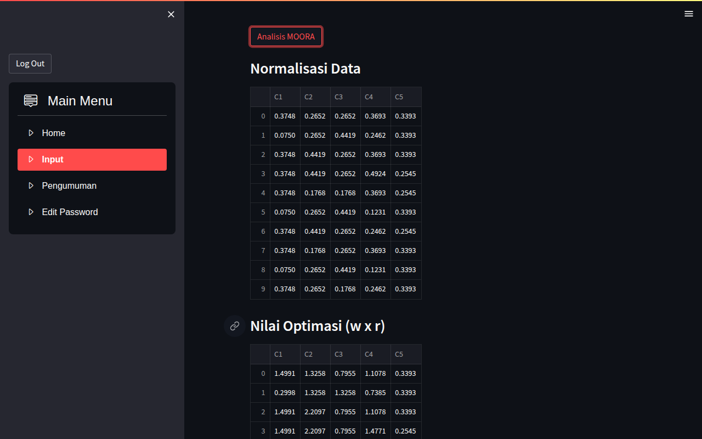

**Tahap 2 — Nilai optimasi.** Hasil normalisasi dikalikan bobot masing-masing kriteria.

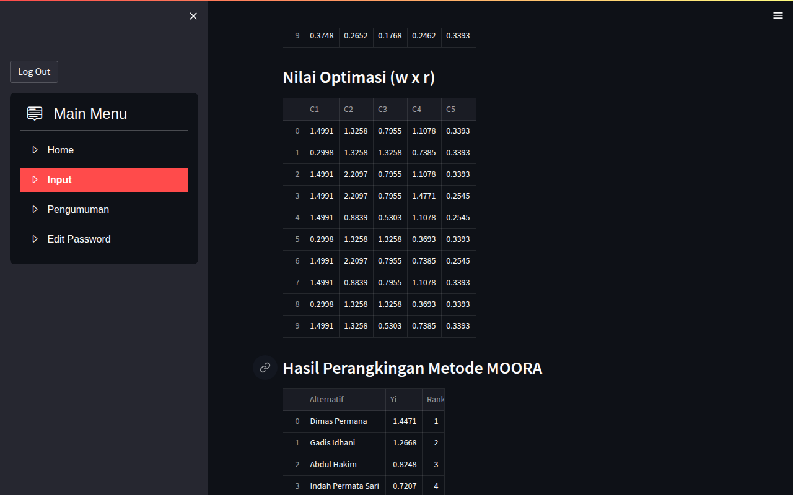

**Tahap 3 — Perangkingan.** Sistem menghitung nilai `Yi` setiap siswa, mengurutkannya dari terbesar, lalu memberi nomor peringkat.

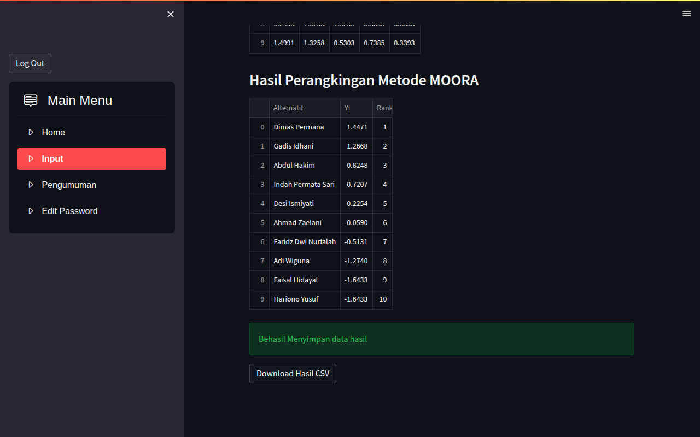

Pesan `Behasil Menyimpan data hasil` menandakan hasil sudah tersimpan dan siap diumumkan. Tekan **Download Hasil CSV** bila ingin menyimpan salinannya sebagai `output.csv`.

> ℹ️ **Nilai `Yi` boleh negatif.** Nilai negatif bukan berarti data salah — `Yi` adalah selisih antara jumlah kriteria *benefit* dan *cost*. Yang menentukan peringkat adalah besar-kecilnya nilai, bukan tanda positif atau negatifnya.

> 🔑 Pada langkah ini sistem juga **membuatkan akun untuk setiap siswa** pada daftar. Aturan pembentukannya ada pada [Rujukan Singkat](#akun-siswa-otomatis).

## Langkah 7 · Lihat pengumuman

Pilih menu **Pengumuman** untuk melihat daftar penerima beasiswa, yaitu lima peringkat teratas.

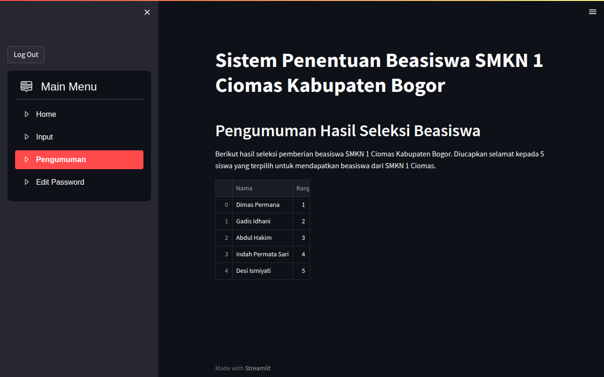

Halaman inilah yang juga dilihat siswa ketika mereka masuk ke sistem.

## Langkah 8 · Ubah kata sandi

Menu **Edit Password** dipakai untuk mengganti kata sandi akun Anda sendiri.

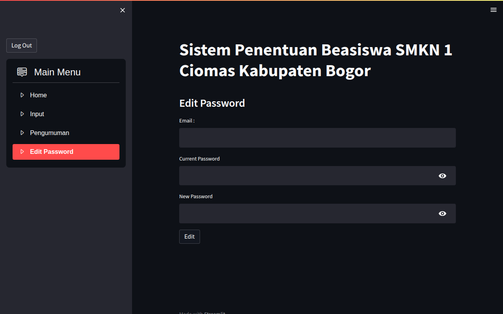

Isi surel, kata sandi saat ini, dan kata sandi baru, lalu tekan **Edit**.

> ⚠️ Kolom surel **tidak terisi otomatis**. Isikan surel akun Anda sendiri, karena sistem mencocokkan surel dengan kata sandi lama.

## Langkah 9 · Keluar dari sistem

Tekan **Log Out** di atas menu samping. Anda akan kembali ke halaman login.

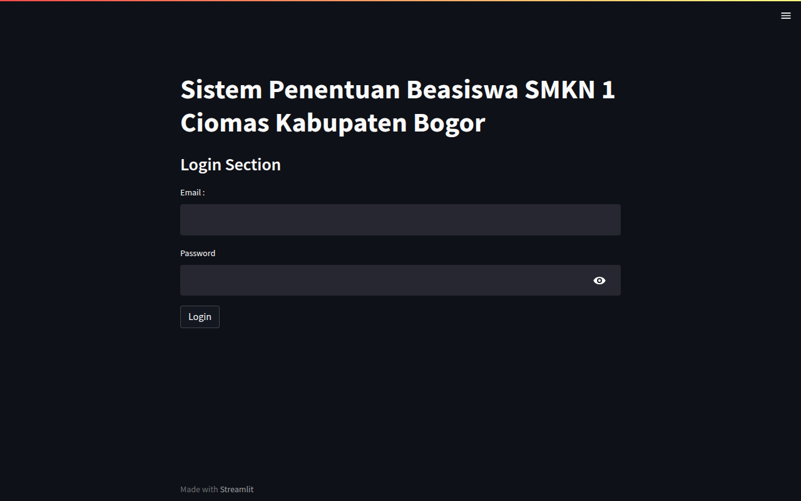

---

# 5. Panduan Siswa

## Langkah 1 · Masuk dengan akun otomatis

Akun siswa **dibuat otomatis** oleh sistem ketika pihak sekolah menjalankan analisis. Siswa tidak perlu mendaftar.

Surel dan kata sandi bawaannya mengikuti aturan berikut:

| Bagian | Aturan | Contoh |
|---|---|---|
| 📧 **Surel** | Dua kata pertama nama, digabung tanpa spasi, ditambah `@gmail.com` | `Dimas Permana` → `DimasPermana@gmail.com` |
| 🔒 **Kata sandi** | Selalu `1234` | `1234` |

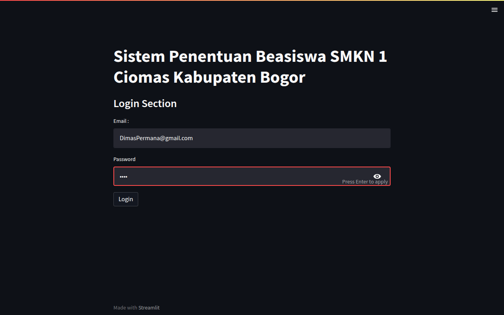

Sama seperti pihak sekolah, setelah pesan `Logged In As` muncul, **tekan Login sekali lagi**.

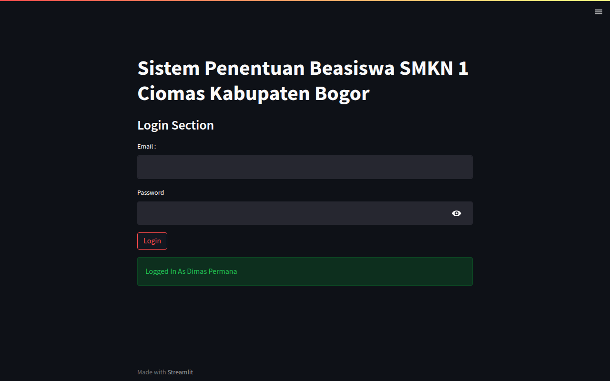

## Langkah 2 · Halaman Home

Halaman Home siswa berisi sambutan dan arahan menuju menu Pengumuman.

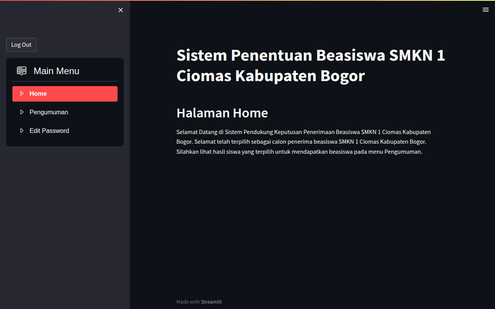

## Langkah 3 · Lihat pengumuman

Pilih menu **Pengumuman** untuk melihat daftar penerima beasiswa.

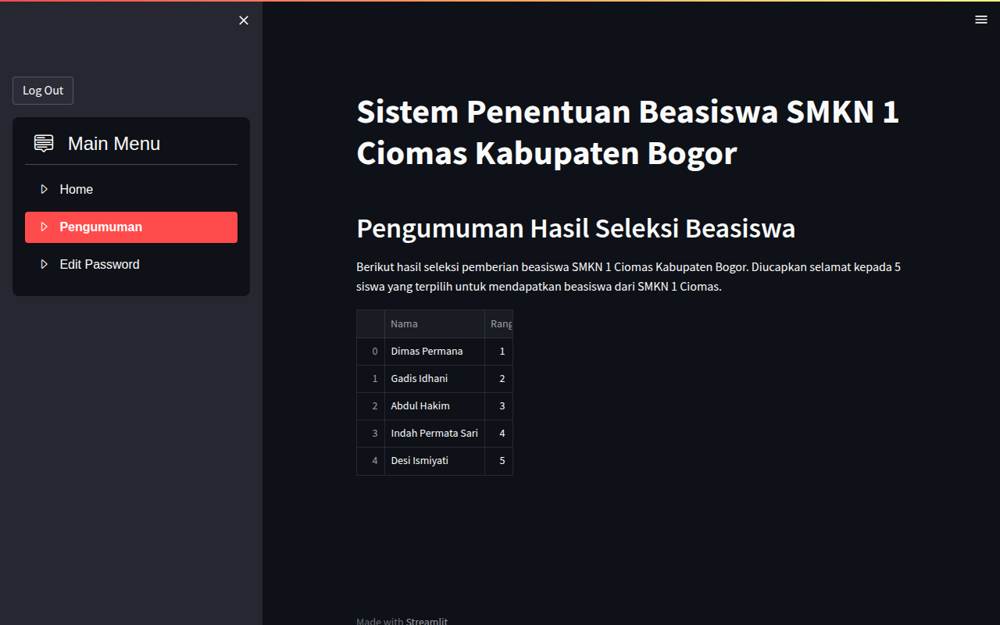

Bila hasil seleksi belum dijalankan pihak sekolah, halaman ini menampilkan keterangan **"Data hasil seleksi belum keluar."**

## Langkah 4 · Ganti kata sandi bawaan

> 🔐 **Sangat disarankan.** Seluruh siswa memperoleh kata sandi awal yang sama, yaitu `1234`. Selama belum diganti, siapa pun yang mengetahui pola surelnya dapat masuk ke akun Anda. Gantilah lewat menu **Edit Password** seperti pada [Langkah 8](#langkah-8--ubah-kata-sandi).

---

# 6. Rujukan Singkat

## Akun bawaan

| Peran | Surel | Kata sandi |
|---|---|---|
| 🏫 Pihak sekolah | `smkn1@gmail.com` | `12345678` |
| 🎒 Siswa | Dibentuk dari nama, lihat di bawah | `1234` |

## Akun siswa otomatis

Surel dibentuk dari **dua kata pertama** nama siswa tanpa spasi, ditambah `@gmail.com`. Nama satu kata memakai kata itu saja.

| Nama siswa | Surel yang terbentuk |
|---|---|
| Abdul Hakim | `AbdulHakim@gmail.com` |
| Indah Permata Sari | `IndahPermata@gmail.com` |
| Dimas Permana | `DimasPermana@gmail.com` |

## Kriteria, bobot, dan atribut

| Kode | Kriteria | Bobot | Atribut |
|:---:|---|:---:|:---:|
| `C1` | Surat Keterangan Tidak Mampu (SKTM) | 4 | 🟢 Benefit |
| `C2` | Status Anak Dalam Keluarga (SADK) | 5 | 🔴 Cost |
| `C3` | Penghasilan Orang Tua (PO) | 3 | 🔴 Cost |
| `C4` | Jumlah Tanggungan Orang Tua (JTO) | 3 | 🟢 Benefit |
| `C5` | Nilai Rata-Rata Rapor Semester Terakhir (NRRST) | 1 | 🟢 Benefit |

## Skala penilaian

| Nilai | Tingkat Kepentingan (bobot) | Rating Kecocokan (nilai siswa) |
|:-----:|---|---|
| `1` | Sangat Rendah (SR) | Sangat Buruk (SB) |
| `2` | Rendah (R) | Buruk (B) |
| `3` | Cukup (C) | Cukup (C) |
| `4` | Tinggi (T) | Baik (T) |
| `5` | Sangat Tinggi (ST) | Sangat Baik (ST) |

---

# 7. Penyelesaian Masalah

| Gejala | Penyebab | Yang perlu dilakukan |
|---|---|---|
| Sudah menekan **Login** dan muncul `Logged In As`, tetapi menu tidak muncul | Perilaku aplikasi: menu baru tampil pada pemuatan berikutnya ([KI-10](SRS.md#51-daftar-temuan)) | **Tekan tombol Login sekali lagi** |
| Muncul pesan `email dan password salah` | Surel atau kata sandi keliru | Periksa ejaannya. Surel siswa memakai huruf besar di awal tiap kata, misalnya `AbdulHakim@gmail.com` |
| Menu **Input** tidak ada | Anda masuk sebagai siswa | Menu Input memang hanya untuk pihak sekolah |
| Pengumuman menyatakan `Data hasil seleksi belum keluar` | Analisis MOORA belum pernah dijalankan | Minta pihak sekolah menjalankan analisis lebih dulu |
| Muncul pesan galat teknis setelah menekan **Analisis MOORA** | Struktur berkas CSV tidak sesuai ketentuan ([KI-03](SRS.md#51-daftar-temuan)) | Unduh ulang template, isi mengikuti contohnya, pastikan tidak ada sel kosong |
| Hasil analisis sebelumnya hilang | Setiap analisis baru menggantikan hasil lama ([KI-06](SRS.md#51-daftar-temuan)) | Unduh `output.csv` setiap selesai analisis sebagai arsip |
| Nilai `Yi` bernilai negatif | Wajar, `Yi` adalah selisih *benefit* dikurangi *cost* | Tidak perlu diperbaiki; peringkat tetap dihitung dari nilai terbesar |

---

# 8. Catatan Versi

| Hal | Keterangan |
|---|---|
| 📅 **Tanggal pengambilan** | 13 September 2026 |
| 🖥️ **Versi aplikasi** | Streamlit `1.10.0`, streamlit-option-menu `0.3.2`, sesuai `requirements.txt` |
| 🎨 **Tema** | Gelap, sesuai bawaan `.streamlit/config.toml` |
| 📐 **Ukuran layar** | 1280 × 800 piksel |
| 📊 **Data contoh** | `template.csv` bawaan repositori — seluruh nama bersifat fiktif |

## Memperbarui screenshot

Seluruh gambar pada manual ini diambil otomatis, sehingga dapat diperbarui setiap kali tampilan aplikasi berubah:

```bash
# 1. Jalankan aplikasi atas SALINAN proyek
#    (analisis MOORA mengosongkan tabel `hasil` dan menambah akun siswa)
cp -r . /tmp/spk-demo && cd /tmp/spk-demo
streamlit run main.py --server.port 8501 --server.headless true

# 2. Dari direktori repositori, jalankan pengambil screenshot
pip install playwright && playwright install chromium
python tools/capture_manual.py --out docs/img
```

Rincian opsi skrip ada pada [`tools/README.md`](../tools/README.md).

---

<div align="center">

[⬆️ Kembali ke atas](#-manual-book) · [📚 Indeks Dokumentasi](README.md) · [📋 SRS](SRS.md) · [🚀 Daftar Fitur](FITUR.md) · [🗺️ Flowmap](FLOWMAP.md)

</div>
