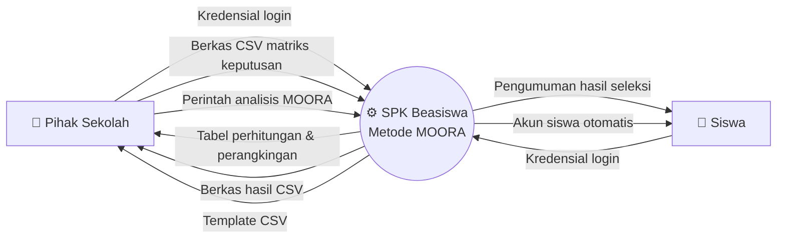
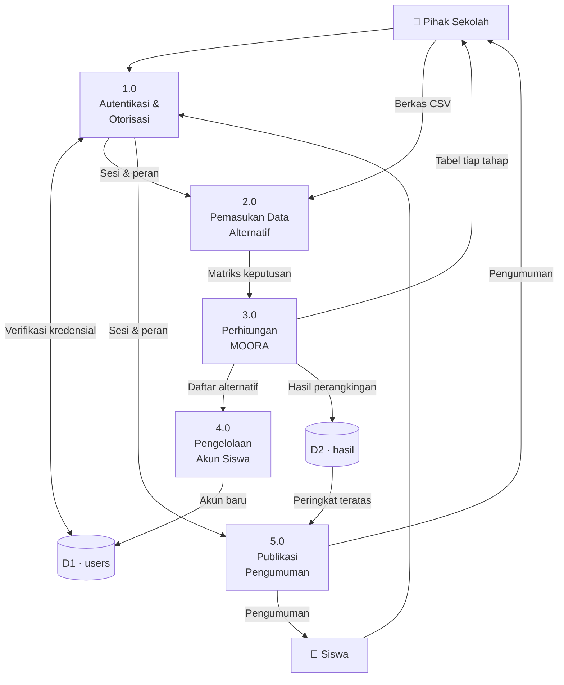
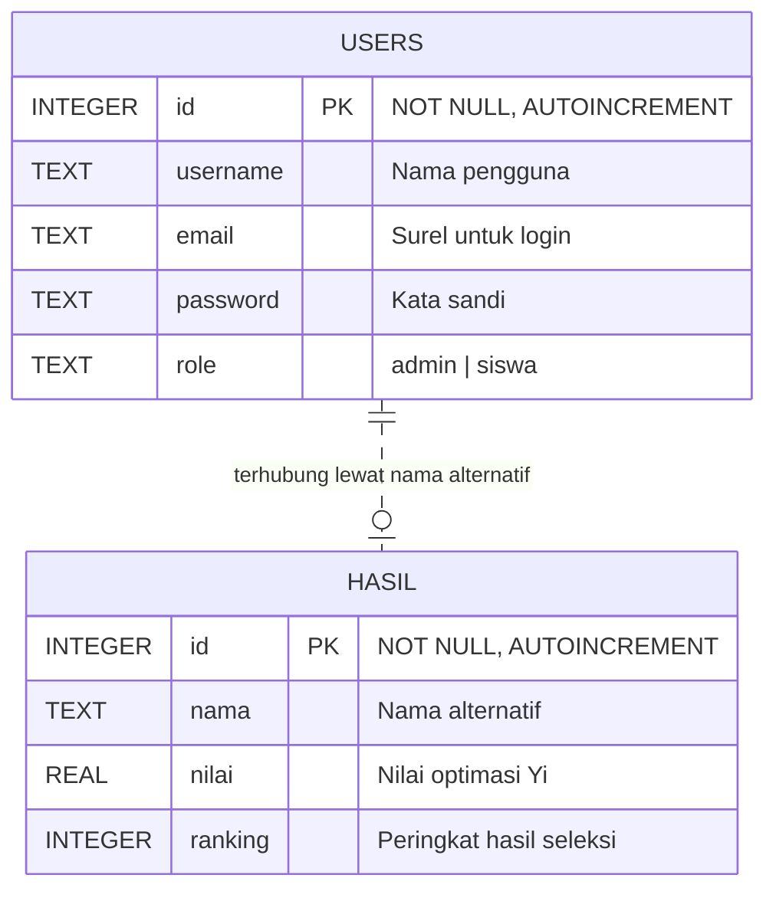

<div align="center">

# 📋 Spesifikasi Kebutuhan Perangkat Lunak

### Sistem Pendukung Keputusan Penentuan Penerima Beasiswa
**Metode MOORA — SMK Negeri 1 Ciomas, Kabupaten Bogor**

<br/>


`SRS / SKPL — Software Requirements Specification`

</div>

---

## 📑 Daftar Isi

| Bab | Judul |
|:---:|---|
| **1** | [Pendahuluan](#1-pendahuluan) |
| **2** | [Deskripsi Umum](#2-deskripsi-umum) |
| **3** | [Kebutuhan Khusus](#3-kebutuhan-khusus) |
| **4** | [Matriks Keterlacakan](#4-matriks-keterlacakan) |
| **5** | [Catatan Implementasi & Known Issues](#5-catatan-implementasi--known-issues) |
| — | [Lampiran A: Riwayat Revisi](#lampiran-a-riwayat-revisi) |

> 📎 **Dokumen terkait:** [Daftar Fitur](FITUR.md) · [Flowmap & Flowchart](FLOWMAP.md) · [README Proyek](../README.md)

---

# 1. Pendahuluan

## 1.1 Tujuan Penulisan Dokumen

Dokumen ini menjelaskan spesifikasi kebutuhan perangkat lunak **Sistem Pendukung Keputusan (SPK) Penentuan Penerima Beasiswa** dengan metode MOORA. Dokumen ditujukan kepada:

| Pembaca | Kegunaan dokumen |
|---|---|
| 👨‍💻 **Pengembang** | Acuan implementasi, pemeliharaan, dan pengembangan lanjutan |
| 🏫 **Pihak sekolah** | Verifikasi bahwa sistem menjawab kebutuhan proses seleksi beasiswa |
| 🎓 **Penguji / dosen pembimbing** | Dasar penilaian kesesuaian sistem dengan kebutuhan yang dirumuskan |
| 🧪 **Penguji perangkat lunak** | Sumber kasus uji — setiap kebutuhan fungsional memuat prakondisi dan pascakondisi |

Setiap kebutuhan dalam dokumen ini diberi pengenal unik (`SRS-F-xx` untuk fungsional, `SRS-NF-xx` untuk non-fungsional) dan dilengkapi rujukan ke berkas serta baris kode yang mengimplementasikannya, sehingga status pemenuhan tiap kebutuhan dapat diperiksa langsung pada kode sumber.

## 1.2 Lingkup Masalah

**Nama perangkat lunak:** SPK Beasiswa — Metode MOORA

Proses seleksi penerima beasiswa yang dilakukan secara manual memiliki tiga kelemahan: memakan waktu, rentan terhadap subjektivitas penilai, dan sulit dipertanggungjawabkan karena dasar perhitungannya tidak terekam. Perangkat lunak ini mengatasi ketiga hal tersebut dengan menerapkan metode **MOORA** *(Multi-Objective Optimization on the basis of Ratio Analysis)* pada data calon penerima beasiswa.

### ✅ Termasuk dalam lingkup

- Autentikasi dan otorisasi dua peran pengguna: pihak sekolah dan siswa
- Pemasukan data calon penerima beasiswa melalui unggahan berkas CSV
- Perhitungan metode MOORA: normalisasi, pembobotan, nilai optimasi `Yi`, dan perangkingan
- Penyajian setiap tahap perhitungan dalam bentuk tabel agar hasil dapat ditelusuri
- Penyimpanan hasil seleksi pada basis data lokal
- Publikasi pengumuman hasil seleksi kepada siswa
- Pembuatan akun siswa secara otomatis berdasarkan data alternatif
- Ekspor hasil perangkingan ke berkas CSV

### ❌ Tidak termasuk dalam lingkup

- Konversi otomatis data mentah siswa (SKTM, penghasilan, nilai rapor) menjadi rating kecocokan 1–5 — konversi dilakukan manual oleh pihak sekolah sebelum berkas CSV diunggah
- Manajemen data induk siswa, kelas, atau tahun ajaran
- Integrasi dengan sistem informasi sekolah, Dapodik, atau layanan eksternal lain
- Pencairan, pelaporan, atau pemantauan penggunaan dana beasiswa
- Notifikasi melalui surel atau pesan singkat
- Dukungan metode SPK lain selain MOORA (SAW, TOPSIS, AHP, dsb.)

## 1.3 Definisi, Akronim, dan Singkatan

| Istilah | Penjelasan |
|---|---|
| **SPK** | Sistem Pendukung Keputusan — sistem yang membantu pengambil keputusan, bukan menggantikannya |
| **MOORA** | *Multi-Objective Optimization on the basis of Ratio Analysis* — metode pengambilan keputusan multi-kriteria |
| **SKPL** | Spesifikasi Kebutuhan Perangkat Lunak (padanan SRS) |
| **SRS** | *Software Requirements Specification* |
| **Alternatif** | Objek yang dinilai dan dirangking; dalam sistem ini adalah siswa calon penerima beasiswa |
| **Kriteria** | Aspek penilaian yang dipakai untuk menilai alternatif (`C1` … `Cn`) |
| **Bobot** | Angka tingkat kepentingan sebuah kriteria, bernilai 1–5 |
| **Atribut** | Sifat kriteria: *benefit* atau *cost* |
| **Benefit** | Atribut yang nilainya semakin tinggi semakin baik — dikodekan `1` pada berkas CSV |
| **Cost** | Atribut yang nilainya semakin rendah semakin baik — dikodekan `0` pada berkas CSV |
| **Matriks keputusan** | Matriks berisi nilai setiap alternatif pada setiap kriteria |
| **Normalisasi** | Penyetaraan satuan antar kriteria agar nilainya dapat diperbandingkan |
| **Nilai optimasi (Yi)** | Nilai akhir sebuah alternatif; selisih jumlah atribut *benefit* dan *cost* |
| **Rating kecocokan** | Skala 1–5 hasil konversi data mentah siswa |
| **SKTM** | Surat Keterangan Tidak Mampu |
| **SADK** | Status Anak Dalam Keluarga |
| **PO** | Penghasilan Orang Tua |
| **JTO** | Jumlah Tanggungan Orang Tua |
| **NRRST** | Nilai Rata-Rata Rapor Semester Terakhir |
| **CSV** | *Comma-Separated Values* — format berkas masukan sistem |

## 1.4 Referensi

| No | Referensi |
|:--:|---|
| [1] | Brauers, W. K. M., & Zavadskas, E. K. (2006). *The MOORA method and its application to privatization in a transition economy.* Control and Cybernetics, 35(2), 445–469. |
| [2] | IEEE Std 830-1998 — *IEEE Recommended Practice for Software Requirements Specifications.* |
| [3] | Dokumentasi Streamlit — https://docs.streamlit.io |
| [4] | Dokumentasi SQLite — https://www.sqlite.org/docs.html |
| [5] | Berkas `README.md` pada repositori ini |

## 1.5 Deskripsi Umum Dokumen

- **Bab 1** memuat tujuan, lingkup, dan daftar istilah.
- **Bab 2** menjelaskan sistem secara umum: perspektif produk, fungsi utama, karakteristik pengguna, batasan, serta asumsi.
- **Bab 3** memuat kebutuhan rinci yang menjadi acuan implementasi dan pengujian.
- **Bab 4** memetakan setiap kebutuhan ke fitur dan lokasi kode.
- **Bab 5** mencatat kondisi implementasi saat ini beserta temuan yang belum terselesaikan.

---

# 2. Deskripsi Umum

## 2.1 Perspektif Produk

Sistem berjalan sebagai aplikasi web mandiri berbasis **Streamlit**, tanpa ketergantungan pada sistem lain. Seluruh data tersimpan pada satu berkas basis data **SQLite** (`beasiswa.db`) di mesin yang sama dengan aplikasi.

### Diagram Konteks (DFD Level 0)

> Digambarkan dengan notasi *flowchart* Mermaid; persegi menyatakan entitas luar, lingkaran menyatakan sistem.



### Diagram Aliran Data (DFD Level 1)



## 2.2 Fungsi Produk

| Kelompok | Fungsi |
|---|---|
| 🔐 **Autentikasi & Otorisasi** | Login berbasis surel dan kata sandi; penentuan menu sesuai peran; logout |
| 📥 **Pemasukan Data** | Unduh template CSV; unggah berkas CSV matriks keputusan |
| 🧮 **Perhitungan** | Normalisasi, pembobotan, perhitungan `Yi`, perangkingan, penyajian tabel tiap tahap |
| 💾 **Penyimpanan** | Simpan hasil perangkingan; buat akun siswa otomatis |
| 📢 **Publikasi** | Tampilkan pengumuman penerima beasiswa kepada siswa dan pihak sekolah |
| 📤 **Ekspor** | Unduh hasil perangkingan sebagai berkas CSV |
| 🔑 **Akun** | Ubah kata sandi mandiri |

## 2.3 Karakteristik Pengguna

| Aspek | 🏫 Pihak Sekolah | 🎒 Siswa |
|---|---|---|
| **Nilai `role`** | `admin` | `siswa` |
| **Jumlah** | Satu akun bersama | Sebanyak alternatif yang diunggah |
| **Tanggung jawab** | Menyiapkan data, menjalankan analisis, mengumumkan hasil | Melihat hasil seleksi |
| **Hak akses** | Home, Input, Pengumuman, Edit Password | Home, Pengumuman, Edit Password |
| **Kemampuan teknis** | Mampu mengoperasikan aplikasi lembar kerja dan menyunting berkas CSV | Mampu mengoperasikan peramban web |
| **Pengetahuan MOORA** | Memahami konsep kriteria, bobot, serta atribut *benefit*/*cost* | Tidak diperlukan |
| **Frekuensi pemakaian** | Musiman, saat periode seleksi beasiswa | Sesekali, saat pengumuman |

## 2.4 Batasan-Batasan

### Batasan Teknis

| No | Batasan |
|:--:|---|
| BT-01 | Sistem berjalan pada Python versi 3.7 hingga 3.10 |
| BT-02 | Antarmuka dibangun sepenuhnya dengan Streamlit `1.10.0`; tampilan mengikuti keterbatasan kerangka kerja tersebut |
| BT-03 | Basis data berupa berkas tunggal SQLite; tidak mendukung akses tulis serentak dari banyak proses |
| BT-04 | Aplikasi dilayani melalui HTTP pada porta `8501`; tanpa HTTPS bawaan |
| BT-05 | Berkas basis data tersimpan pada sistem berkas lokal; tidak ada replikasi maupun pencadangan otomatis |

### Batasan Fungsional

| No | Batasan |
|:--:|---|
| BF-01 | Data masukan wajib berupa berkas CSV dengan struktur tiga bagian (baris `Kriteria`, `Atribut`, `Bobot`, diikuti baris alternatif) |
| BF-02 | Nilai alternatif wajib sudah dikonversi ke rating kecocokan `1`–`5` sebelum diunggah |
| BF-03 | Bobot kriteria wajib bernilai `1`–`5`; atribut wajib bernilai `1` (*benefit*) atau `0` (*cost*) |
| BF-04 | Jumlah penerima yang diumumkan dipatok lima peringkat teratas |
| BF-05 | Hanya tersedia satu akun pihak sekolah, dibuat langsung pada basis data tanpa antarmuka pendaftaran |
| BF-06 | Hasil analisis terbaru menggantikan hasil sebelumnya; sistem tidak menyimpan riwayat seleksi |

## 2.5 Asumsi dan Ketergantungan

### Asumsi

| No | Asumsi |
|:--:|---|
| AS-01 | Pihak sekolah telah menetapkan kriteria, bobot, dan atribut sebelum menggunakan sistem |
| AS-02 | Data mentah siswa telah dikonversi ke rating kecocokan `1`–`5` secara benar dan konsisten |
| AS-03 | Berkas CSV yang diunggah mengikuti struktur template yang disediakan sistem |
| AS-04 | Nama siswa bersifat unik pada dua kata pertama, sehingga surel yang dibentuk tidak bertabrakan |
| AS-05 | Sistem dipakai di lingkungan tepercaya (jaringan sekolah atau mesin lokal), bukan terbuka ke internet publik |
| AS-06 | Keputusan akhir pemberian beasiswa tetap berada pada pihak sekolah; sistem berperan sebagai pendukung keputusan |

### Ketergantungan

| Komponen | Versi | Sifat |
|---|---|---|
| Python | 3.7 – 3.10 | Wajib |
| `streamlit` | `1.10.0` | Wajib — tercantum pada `requirements.txt` |
| `streamlit-option-menu` | `0.3.2` | Wajib — tercantum pada `requirements.txt` |
| `pandas` | mengikuti Streamlit | Wajib — **tidak** tercantum eksplisit, ikut sebagai dependensi transitif (lihat KI-08) |
| `numpy` | mengikuti Streamlit | Wajib — **tidak** tercantum eksplisit, ikut sebagai dependensi transitif (lihat KI-08) |
| `sqlite3` | bawaan Python | Wajib |
| Peramban web | modern | Wajib untuk mengakses antarmuka |

---

# 3. Kebutuhan Khusus

## 3.1 Kebutuhan Antarmuka Eksternal

### 3.1.1 Antarmuka Pengguna

Antarmuka berupa halaman web satu kolom dengan menu samping (*sidebar*), bertema gelap sesuai `.streamlit/config.toml`. Struktur halaman dibentuk dengan `st.container()` pada `main.py:73-80`.

| Halaman | Akses | Elemen antarmuka | Rujukan kode |
|---|---|---|---|
| **Login** | Publik | Kolom surel, kolom kata sandi (tersamar), tombol `Login` | `main.py:120-135` |
| **Home** | `admin` | Teks pengantar, Tabel 1–6 referensi kriteria, tombol `Download Template CSV`, petunjuk penggunaan | `home.py:12-133` |
| **Home** | `siswa` | Teks pengantar dan arahan menuju menu Pengumuman | `home.py:4-10` |
| **Input** | `admin` | Pengunggah berkas CSV, pratayang data, tombol `Analisis MOORA`, tabel tiap tahap perhitungan, tombol `Download Hasil CSV` | `main.py:137-161` |
| **Pengumuman** | `admin`, `siswa` | Teks pengumuman dan tabel lima peringkat teratas, atau pesan bahwa hasil belum tersedia | `main.py:163-178` |
| **Edit Password** | `admin`, `siswa` | Kolom surel, kata sandi lama, kata sandi baru, tombol `Edit` | `main.py:180-187` |
| **Menu samping** | Terautentikasi | `option_menu` berisi daftar menu sesuai peran, tombol `Log Out` | `main.py:83-102`, `115-118` |

### 3.1.2 Antarmuka Perangkat Keras

Sistem tidak berinteraksi langsung dengan perangkat keras khusus. Kebutuhan minimum mengikuti kebutuhan menjalankan Python beserta peramban web: prosesor kelas desktop, memori 2 GB, dan ruang penyimpanan bebas sekitar 500 MB untuk lingkungan Python beserta dependensinya.

### 3.1.3 Antarmuka Perangkat Lunak

| Antarmuka | Keterangan |
|---|---|
| **Basis data** | Modul `sqlite3` mengakses berkas `beasiswa.db` dengan `check_same_thread=False` (`main.py:9-10`) |
| **Sistem berkas** | Pembacaan `template.csv` (`home.py:105`); pembacaan berkas CSV unggahan melalui `pd.read_csv` (`main.py:142`) |
| **Kerangka kerja web** | Streamlit menyediakan peladen HTTP, komponen antarmuka, dan manajemen sesi melalui `st.session_state` |
| **Komponen pihak ketiga** | `streamlit-option-menu` untuk menu samping (`main.py:90-93`) |

### 3.1.4 Antarmuka Komunikasi

| Aspek | Nilai |
|---|---|
| Protokol | HTTP |
| Porta | `8501` (bawaan Streamlit) |
| Alamat lokal | `http://localhost:8501` |
| Format pertukaran data | WebSocket internal Streamlit antara peramban dan peladen |
| Berkas masuk | CSV (`text/csv`) |
| Berkas keluar | CSV (`text/csv`) |

> ⚠️ Pada konfigurasi Dev Container (`.devcontainer/devcontainer.json`), aplikasi dijalankan dengan `--server.enableCORS false --server.enableXsrfProtection false`. Konfigurasi ini hanya layak untuk lingkungan pengembangan.

---

## 3.2 Kebutuhan Fungsional

### 🏷️ Keterangan Status

| Lambang | Arti |
|:--:|---|
| ✅ | **Terimplementasi** — kebutuhan terpenuhi sepenuhnya pada kode saat ini |
| ⚠️ | **Sebagian** — kebutuhan terpenuhi sebagian; lihat catatan pada bab 5 |
| 📋 | **Belum** — kebutuhan telah dirumuskan namun belum diimplementasikan |

<br/>

### SRS-F-01 · Autentikasi Pengguna

| Field | Isi |
|---|---|
| **Aktor** | Pihak Sekolah, Siswa |
| **Deskripsi** | Sistem memverifikasi surel dan kata sandi pengguna terhadap tabel `users`, lalu membentuk sesi bila cocok |
| **Prakondisi** | Pengguna belum terautentikasi; akun telah terdaftar pada tabel `users` |
| **Alur** | 1. Pengguna mengisi surel dan kata sandi · 2. Pengguna menekan tombol `Login` · 3. Sistem menjalankan kueri `SELECT` dengan pasangan surel dan kata sandi · 4. Bila ditemukan, sistem menyimpan status `loggedIn` dan `role` pada `st.session_state` · 5. Bila tidak ditemukan, sistem menampilkan pesan galat |
| **Pascakondisi** | Sesi terbentuk beserta peran pengguna, atau pesan galat tampil tanpa perubahan sesi |
| **Prioritas** | Wajib |
| **Status** | ⚠️ Sebagian — tombol `Login` perlu ditekan dua kali sebelum menu muncul (lihat KI-10) |
| **Rujukan Kode** | `main.py:13-16`, `main.py:120-135`, `main.py:189-200` |

### SRS-F-02 · Otorisasi Menu Berbasis Peran

| Field | Isi |
|---|---|
| **Aktor** | Pihak Sekolah, Siswa |
| **Deskripsi** | Sistem menyusun daftar menu sesuai nilai `role` pada sesi, sehingga menu `Input` hanya tersedia bagi pihak sekolah |
| **Prakondisi** | Pengguna telah terautentikasi (SRS-F-01) |
| **Alur** | 1. Sistem membaca `st.session_state['role']` · 2. Bila bernilai `siswa`, menu berisi Home, Pengumuman, Edit Password · 3. Bila bernilai lain, menu berisi Home, Input, Pengumuman, Edit Password · 4. Sistem mengarahkan tampilan sesuai menu yang dipilih |
| **Pascakondisi** | Hanya menu yang sesuai peran tampil pada menu samping |
| **Prioritas** | Wajib |
| **Status** | ✅ Terimplementasi |
| **Catatan** | Otorisasi bekerja dengan pola *deny-by-default terbalik*: setiap peran selain `siswa` diperlakukan sebagai pihak sekolah |
| **Rujukan Kode** | `main.py:83-102`, `main.py:105-110` |

### SRS-F-03 · Mengakhiri Sesi (Logout)

| Field | Isi |
|---|---|
| **Aktor** | Pihak Sekolah, Siswa |
| **Deskripsi** | Sistem mengakhiri sesi pengguna dan menampilkan kembali halaman login |
| **Prakondisi** | Pengguna telah terautentikasi |
| **Alur** | 1. Pengguna menekan tombol `Log Out` pada menu samping · 2. Sistem mengatur `loggedIn` menjadi `False` · 3. Halaman login ditampilkan kembali |
| **Pascakondisi** | Pengguna tidak lagi dapat mengakses halaman yang memerlukan autentikasi |
| **Prioritas** | Wajib |
| **Status** | ⚠️ Sebagian — nilai `role` tidak dibersihkan saat logout (lihat KI-05) |
| **Rujukan Kode** | `main.py:112-118` |

### SRS-F-04 · Unggah Matriks Keputusan Berkas CSV

| Field | Isi |
|---|---|
| **Aktor** | Pihak Sekolah |
| **Deskripsi** | Sistem menerima berkas CSV berisi kriteria, atribut, bobot, dan data alternatif, lalu menampilkan pratayangnya |
| **Prakondisi** | Pengguna terautentikasi sebagai pihak sekolah; berkas CSV telah disiapkan sesuai ketentuan pada bab 3.3 |
| **Alur** | 1. Pengguna membuka menu `Input` · 2. Pengguna memilih berkas berekstensi `.csv` · 3. Sistem membaca berkas dengan `pd.read_csv` · 4. Sistem menampilkan seluruh isi berkas sebagai tabel pratayang |
| **Pascakondisi** | Data tersedia dalam memori dan siap dianalisis |
| **Prioritas** | Wajib |
| **Status** | ✅ Terimplementasi |
| **Rujukan Kode** | `main.py:137-143` |

### SRS-F-05 · Perhitungan Metode MOORA

| Field | Isi |
|---|---|
| **Aktor** | Pihak Sekolah |
| **Deskripsi** | Sistem menghitung normalisasi, nilai optimasi, dan nilai `Yi` setiap alternatif berdasarkan metode MOORA |
| **Prakondisi** | Berkas CSV telah diunggah (SRS-F-04) |
| **Alur** | 1. Sistem memisahkan matriks nilai, daftar kriteria, bobot, dan atribut dari berkas · 2. Normalisasi: `r_ij = x_ij / √(Σ x_ij²)` · 3. Nilai optimasi: `v_ij = w_j × r_ij` · 4. Akumulasi per atribut: nilai kriteria *benefit* dijumlahkan ke `temp_max`, kriteria *cost* ke `temp_min` · 5. Nilai akhir: `Y_i = temp_max_i − temp_min_i` |
| **Pascakondisi** | Nilai `Yi` setiap alternatif tersedia untuk diperingkat |
| **Prioritas** | Wajib |
| **Status** | ✅ Terimplementasi |
| **Rujukan Kode** | `moora.py:5-43` |

### SRS-F-06 · Penyajian Tabel Setiap Tahap Perhitungan

| Field | Isi |
|---|---|
| **Aktor** | Pihak Sekolah |
| **Deskripsi** | Sistem menampilkan tabel hasil normalisasi, tabel nilai optimasi, dan tabel perangkingan agar perhitungan dapat ditelusuri dan dipertanggungjawabkan |
| **Prakondisi** | Perhitungan MOORA sedang dijalankan (SRS-F-05) |
| **Alur** | 1. Sistem menampilkan tabel `Normalisasi Data` · 2. Sistem menampilkan tabel `Nilai Optimasi (w x r)` · 3. Sistem menampilkan tabel `Hasil Perangkingan Metode MOORA` |
| **Pascakondisi** | Ketiga tabel tampil berurutan pada halaman `Input` |
| **Prioritas** | Wajib |
| **Status** | ✅ Terimplementasi |
| **Rujukan Kode** | `moora.py:17-18`, `moora.py:27-28`, `moora.py:51-52` |

### SRS-F-07 · Perangkingan Alternatif

| Field | Isi |
|---|---|
| **Aktor** | Pihak Sekolah |
| **Deskripsi** | Sistem mengurutkan alternatif berdasarkan nilai `Yi` secara menurun dan memberikan nomor peringkat mulai dari `1` |
| **Prakondisi** | Nilai `Yi` setiap alternatif telah dihitung (SRS-F-05) |
| **Alur** | 1. Sistem menyusun tabel berisi nama alternatif dan nilai `Yi`, masing-masing dengan tipe datanya sendiri · 2. Sistem mengurutkan tabel secara menurun berdasarkan `Yi` · 3. Sistem memberi nomor peringkat `1` hingga `n` sesuai urutan hasil |
| **Pascakondisi** | Tabel perangkingan tersedia dengan kolom `Alternatif`, `Yi`, dan `Ranking` |
| **Prioritas** | Wajib |
| **Status** | ✅ Terimplementasi |
| **Rujukan Kode** | `moora.py:46-54` |

### SRS-F-08 · Pembuatan Akun Siswa Otomatis

| Field | Isi |
|---|---|
| **Aktor** | Sistem (dipicu Pihak Sekolah) |
| **Deskripsi** | Sistem membentuk akun bagi setiap alternatif yang belum memiliki akun, menggunakan surel turunan nama dan kata sandi bawaan |
| **Prakondisi** | Perhitungan MOORA selesai dan daftar alternatif tersedia |
| **Alur** | 1. Sistem membentuk surel dari dua kata pertama nama ditambah `@gmail.com` · 2. Sistem membaca seluruh baris tabel `users` · 3. Untuk setiap surel yang belum terdaftar, sistem menyusun baris akun baru dengan kata sandi `1234` dan peran `siswa` · 4. Sistem menyimpan akun baru secara serentak dengan `executemany` |
| **Pascakondisi** | Setiap alternatif memiliki tepat satu akun; akun yang sudah ada tidak diduplikasi |
| **Prioritas** | Wajib |
| **Status** | ✅ Terimplementasi |
| **Catatan** | Nama satu kata menghasilkan surel dari kata tunggal tersebut; nama dengan dua kata pertama identik berpotensi bertabrakan (lihat KI-04) |
| **Rujukan Kode** | `main.py:28-55`, `main.py:147-159` |

### SRS-F-09 · Penyimpanan Hasil Seleksi

| Field | Isi |
|---|---|
| **Aktor** | Sistem (dipicu Pihak Sekolah) |
| **Deskripsi** | Sistem menyimpan tabel perangkingan ke tabel `hasil` agar dapat ditampilkan pada halaman pengumuman |
| **Prakondisi** | Tabel perangkingan telah terbentuk (SRS-F-07) |
| **Alur** | 1. Sistem mengosongkan tabel `hasil` · 2. Sistem mengatur ulang penghitung `AUTOINCREMENT` · 3. Sistem menyimpan seluruh baris hasil (nama, nilai, peringkat) · 4. Sistem menampilkan pesan keberhasilan, atau pesan galat bila terjadi kegagalan |
| **Pascakondisi** | Tabel `hasil` berisi tepat hasil analisis terakhir |
| **Prioritas** | Wajib |
| **Status** | ✅ Terimplementasi |
| **Catatan** | Hasil sebelumnya terhapus; sistem tidak menyimpan riwayat (lihat KI-06) |
| **Rujukan Kode** | `main.py:57-65` |

### SRS-F-10 · Publikasi Pengumuman Hasil Seleksi

| Field | Isi |
|---|---|
| **Aktor** | Pihak Sekolah, Siswa |
| **Deskripsi** | Sistem menampilkan lima alternatif dengan peringkat teratas sebagai penerima beasiswa |
| **Prakondisi** | Pengguna terautentikasi |
| **Alur** | 1. Sistem membaca kolom `nama` dan `ranking` dari tabel `hasil` · 2. Bila data tersedia, sistem menampilkan teks pengumuman beserta tabel lima baris teratas · 3. Bila data belum tersedia, sistem menampilkan pesan bahwa hasil seleksi belum keluar |
| **Pascakondisi** | Pengguna mengetahui daftar penerima beasiswa atau status bahwa hasil belum tersedia |
| **Prioritas** | Wajib |
| **Status** | ✅ Terimplementasi |
| **Catatan** | Jumlah lima penerima dipatok pada kode (lihat KI-07) |
| **Rujukan Kode** | `main.py:67-70`, `main.py:163-178` |

### SRS-F-11 · Unduh Template dan Hasil

| Field | Isi |
|---|---|
| **Aktor** | Pihak Sekolah |
| **Deskripsi** | Sistem menyediakan berkas template CSV sebagai acuan pengisian, serta berkas hasil perangkingan untuk disimpan di luar sistem |
| **Prakondisi** | Untuk template: pengguna berada di halaman Home. Untuk hasil: analisis MOORA telah selesai |
| **Alur** | 1. Sistem membaca `template.csv` dan menyediakannya melalui tombol `Download Template CSV` sebagai `input.csv` · 2. Setelah analisis, sistem menyediakan tabel perangkingan melalui tombol `Download Hasil CSV` sebagai `output.csv` |
| **Pascakondisi** | Berkas terunduh ke perangkat pengguna |
| **Prioritas** | Wajib |
| **Status** | ✅ Terimplementasi |
| **Rujukan Kode** | `home.py:101-106`, `main.py:161` |

### SRS-F-12 · Ubah Kata Sandi

| Field | Isi |
|---|---|
| **Aktor** | Pihak Sekolah, Siswa |
| **Deskripsi** | Pengguna dapat mengganti kata sandi miliknya setelah memverifikasi kata sandi lama |
| **Prakondisi** | Pengguna terautentikasi; akun terdaftar pada tabel `users` |
| **Alur** | 1. Pengguna mengisi surel, kata sandi lama, dan kata sandi baru · 2. Pengguna menekan tombol `Edit` · 3. Sistem memverifikasi pasangan surel dan kata sandi lama · 4. Bila cocok, sistem memperbarui kata sandi dan menampilkan pesan keberhasilan · 5. Bila tidak cocok, sistem menampilkan pesan galat |
| **Pascakondisi** | Kata sandi tergantikan, atau tidak ada perubahan bila verifikasi gagal |
| **Prioritas** | Wajib |
| **Status** | ✅ Terimplementasi |
| **Catatan** | Surel diisi manual dan tidak diikat ke sesi aktif, sehingga pengguna perlu memasukkan surel miliknya sendiri |
| **Rujukan Kode** | `main.py:18-26`, `main.py:180-187` |

### SRS-F-13 · Kriteria Dinamis

| Field | Isi |
|---|---|
| **Aktor** | Pihak Sekolah |
| **Deskripsi** | Jumlah kriteria dapat ditambah atau dikurangi melalui berkas CSV tanpa mengubah kode sistem |
| **Prakondisi** | Berkas CSV memuat baris `Atribut` dan `Bobot` yang lengkap untuk setiap kolom kriteria |
| **Alur** | 1. Sistem membaca seluruh kolom kriteria dari baris pertama berkas · 2. Seluruh tahap perhitungan dijalankan mengikuti jumlah kolom yang terbaca |
| **Pascakondisi** | Perhitungan menyesuaikan jumlah kriteria pada berkas masukan |
| **Prioritas** | Penting |
| **Status** | ✅ Terimplementasi |
| **Rujukan Kode** | `moora.py:7-10`, `moora.py:14-16`, `moora.py:34-39` |

### SRS-F-14 · Validasi Struktur dan Isi Berkas CSV

| Field | Isi |
|---|---|
| **Aktor** | Sistem |
| **Deskripsi** | Sistem memeriksa kelengkapan dan kesesuaian berkas CSV sebelum perhitungan dijalankan, serta menampilkan pesan yang dapat dipahami pengguna bila berkas tidak sesuai |
| **Prakondisi** | Berkas CSV telah diunggah |
| **Alur** | 1. Periksa keberadaan baris `Atribut` dan `Bobot` · 2. Periksa nilai atribut hanya `0` atau `1` · 3. Periksa nilai bobot berada pada rentang `1`–`5` · 4. Periksa tidak ada sel kosong · 5. Periksa seluruh nilai alternatif berupa angka pada rentang `1`–`5` · 6. Tampilkan daftar kesalahan bila ada, dan hentikan proses |
| **Pascakondisi** | Perhitungan hanya berjalan atas data yang valid |
| **Prioritas** | Penting |
| **Status** | 📋 Belum diimplementasikan — kondisi saat ini dinyatakan pada `home.py:133` dan dicatat sebagai KI-03 |
| **Rujukan Kode** | — |

### SRS-F-15 · Manajemen Akun Pengguna

| Field | Isi |
|---|---|
| **Aktor** | Pihak Sekolah |
| **Deskripsi** | Pihak sekolah dapat melihat, menambah, menyunting, dan menghapus akun pengguna melalui antarmuka aplikasi |
| **Prakondisi** | Pengguna terautentikasi sebagai pihak sekolah |
| **Alur** | 1. Buka menu manajemen akun · 2. Tampilkan daftar akun beserta perannya · 3. Lakukan penambahan, penyuntingan, atau penghapusan akun · 4. Simpan perubahan ke tabel `users` |
| **Pascakondisi** | Data akun termutakhir pada basis data |
| **Prioritas** | Tambahan |
| **Status** | 📋 Belum diimplementasikan — akun pihak sekolah saat ini dibuat langsung pada basis data (BF-05) |
| **Rujukan Kode** | — |

### SRS-F-16 · Penyajian Referensi Kriteria dan Petunjuk Penggunaan

| Field | Isi |
|---|---|
| **Aktor** | Pihak Sekolah |
| **Deskripsi** | Sistem menyajikan tabel referensi kriteria, skala penilaian, contoh data, serta petunjuk penggunaan pada halaman Home, sehingga pengguna dapat mengisi berkas masukan tanpa dokumentasi terpisah |
| **Prakondisi** | Pengguna terautentikasi sebagai pihak sekolah |
| **Alur** | 1. Sistem menampilkan Tabel 1 Kriteria · 2. Tabel 2 Tingkat Kepentingan Setiap Kriteria · 3. Tabel 3 Nilai Bobot dan Atribut Kriteria · 4. Tabel 4 Rating Kecocokan Setiap Alternatif · 5. Tabel 5 Contoh Data Alternatif · 6. Tabel 6 Contoh Data Siswa Dikonversikan Ke Rating Kecocokan · 7. Petunjuk penggunaan enam langkah beserta tombol unduh template |
| **Pascakondisi** | Pengguna memperoleh seluruh acuan yang diperlukan untuk menyiapkan berkas CSV |
| **Prioritas** | Penting |
| **Status** | ✅ Terimplementasi |
| **Catatan** | Label rating kecocokan memakai singkatan `(T)` dan `(ST)` untuk "Baik" dan "Sangat Baik" (lihat KI-09) |
| **Rujukan Kode** | `home.py:21-133` |

---

## 3.3 Kebutuhan Data

### 3.3.1 Diagram Relasi Entitas



> 🔗 Kedua tabel **tidak** memiliki relasi kunci asing pada tingkat basis data. Keterhubungan bersifat logis: kolom `hasil.nama` berasal dari nilai yang sama dengan `users.username`, keduanya dibentuk dari kolom alternatif berkas CSV pada `main.py:148-159`.

### 3.3.2 Kamus Data — Tabel `users`

| Kolom | Tipe | Batasan | Keterangan |
|---|---|---|---|
| `id` | `INTEGER` | `PRIMARY KEY`, `AUTOINCREMENT`, `NOT NULL` | Pengenal baris |
| `username` | `TEXT` | — | Nama pengguna; bagi siswa berisi nama lengkap dari berkas CSV |
| `email` | `TEXT` | — | Surel untuk login; bagi siswa dibentuk otomatis |
| `password` | `TEXT` | — | Kata sandi; bagi siswa bernilai bawaan `1234` |
| `role` | `TEXT` | — | `admin` untuk pihak sekolah, `siswa` untuk siswa |

### 3.3.3 Kamus Data — Tabel `hasil`

| Kolom | Tipe | Batasan | Keterangan |
|---|---|---|---|
| `id` | `INTEGER` | `PRIMARY KEY`, `AUTOINCREMENT`, `NOT NULL` | Pengenal baris |
| `nama` | `TEXT` | — | Nama alternatif |
| `nilai` | `REAL` | — | Nilai optimasi `Yi` hasil perhitungan MOORA |
| `ranking` | `INTEGER` | — | Nomor peringkat, `1` untuk peringkat teratas |

### 3.3.4 Spesifikasi Berkas Masukan CSV

| Baris | Kolom pertama | Kolom berikutnya | Ketentuan |
|:--:|---|---|---|
| **1** | `Kriteria` | Kode kriteria (`C1`, `C2`, …) | Berfungsi sebagai baris tajuk |
| **2** | `Atribut` | `1` atau `0` | `1` = *benefit*, `0` = *cost* |
| **3** | `Bobot` | Angka `1`–`5` | Mengikuti skala tingkat kepentingan |
| **4 dst.** | Nama alternatif | Angka `1`–`5` | Nilai rating kecocokan per kriteria |

Contoh sesuai `template.csv`:

```csv
Kriteria,C1,C2,C3,C4,C5
Atribut,1,0,0,1,1
Bobot,4,5,3,3,1
Abdul Hakim,5,3,3,3,4
Adi Wiguna,1,3,5,2,4
```

### 3.3.5 Kriteria Bawaan

Nilai bawaan berikut dipakai pada template dan tabel referensi halaman Home (`home.py:21-51`):

| Kode | Kriteria | Bobot | Atribut |
|:---:|---|:---:|:---:|
| `C1` | Surat Keterangan Tidak Mampu (SKTM) | 4 | Benefit |
| `C2` | Status Anak Dalam Keluarga (SADK) | 5 | Cost |
| `C3` | Penghasilan Orang Tua (PO) | 3 | Cost |
| `C4` | Jumlah Tanggungan Orang Tua (JTO) | 3 | Benefit |
| `C5` | Nilai Rata-Rata Rapor Semester Terakhir (NRRST) | 1 | Benefit |

---

## 3.4 Kebutuhan Non-Fungsional

### SRS-NF-01 · Kinerja

Perhitungan MOORA memiliki kompleksitas `O(m × n)` dengan `m` jumlah alternatif dan `n` jumlah kriteria, berasal dari perulangan bersarang pada `moora.py:14-16`, `moora.py:24-26`, dan `moora.py:34-39`. Pada beban penggunaan yang dirancang — satu angkatan siswa dengan puluhan hingga ratusan alternatif dan kurang dari sepuluh kriteria — perhitungan selesai tanpa penundaan yang terasa bagi pengguna.

> 📐 Dokumen ini tidak menetapkan ambang waktu respons dalam satuan detik karena belum dilakukan pengukuran kinerja secara formal. Penetapan ambang sebaiknya menyusul setelah pengujian dilakukan.

### SRS-NF-02 · Portabilitas

Sistem wajib dapat dijalankan pada Windows, Linux, dan macOS dengan Python 3.7–3.10, tanpa perubahan kode. Seluruh dependensi tercantum pada `requirements.txt`, dan basis data berupa berkas tunggal yang dapat dipindahkan bersama kode.

### SRS-NF-03 · Ketersediaan Lingkungan Pengembangan

Repositori wajib menyediakan konfigurasi Dev Container (`.devcontainer/devcontainer.json`) agar sistem dapat dijalankan di GitHub Codespaces maupun VS Code Dev Containers dengan pemasangan dependensi otomatis dan penerusan porta `8501`.

### SRS-NF-04 · Usabilitas

| Aspek | Ketentuan |
|---|---|
| Bahasa antarmuka | Bahasa Indonesia |
| Petunjuk penggunaan | Tersedia di halaman Home bagi pihak sekolah, mencakup tabel referensi dan langkah penggunaan (`home.py:101-133`) |
| Umpan balik aksi | Setiap operasi basis data memberi pesan keberhasilan atau kegagalan (`main.py:24`, `26`, `55`, `63`, `65`, `131`, `135`) |
| Keterlacakan hasil | Tabel setiap tahap perhitungan ditampilkan, tidak hanya hasil akhir (SRS-F-06) |
| Tema tampilan | Tema gelap sebagai bawaan (`.streamlit/config.toml`) |

### SRS-NF-05 · Keamanan

| Aspek | Kondisi saat ini | Kebutuhan |
|---|---|---|
| Autentikasi | Pencocokan surel dan kata sandi pada basis data | ✅ Terpenuhi |
| Otorisasi | Pembatasan menu berdasarkan peran | ✅ Terpenuhi |
| Pencegahan injeksi SQL | Seluruh kueri memakai parameter bertanda `?` | ✅ Terpenuhi |
| Penyimpanan kata sandi | Teks biasa tanpa *hashing* | 📋 Perlu *hashing* dengan fungsi khusus kata sandi (lihat KI-02) |
| Kata sandi bawaan | Seragam `1234` bagi seluruh siswa | 📋 Perlu pemaksaan penggantian saat login pertama |
| Kanal komunikasi | HTTP tanpa enkripsi | 📋 Perlu HTTPS bila dipublikasikan ke jaringan luar |
| Proteksi XSRF | Dinonaktifkan pada konfigurasi Dev Container | ⚠️ Hanya layak untuk pengembangan |

### SRS-NF-06 · Keandalan

Sistem wajib menangani kegagalan operasi penyimpanan tanpa berhenti secara tiba-tiba. Saat ini penanganan galat baru diterapkan pada penyimpanan hasil (`main.py:64-65`), sedangkan kegagalan pembacaan berkas CSV belum ditangani (KI-03).

### SRS-NF-07 · Kemudahan Pemeliharaan

Kode dipisahkan menurut tanggung jawab: `main.py` menangani autentikasi, perutean, dan akses basis data; `moora.py` memuat algoritma perhitungan; `home.py` memuat konten halaman Home. Pemisahan ini wajib dipertahankan agar perubahan algoritma tidak menyentuh lapisan antarmuka.

### SRS-NF-08 · Integritas Data

Hasil analisis wajib konsisten dengan data masukan: setiap alternatif pada berkas CSV memperoleh tepat satu baris pada tabel `hasil`, dan setiap alternatif memiliki tepat satu akun pada tabel `users` (SRS-F-08).

---

## 3.5 Atribut Sistem Perangkat Lunak

| Atribut | Ketentuan | Kondisi |
|---|---|---|
| 🔒 **Keamanan** | Autentikasi, otorisasi peran, kueri berparameter | ⚠️ Kata sandi belum di-*hash* |
| 🛡️ **Keandalan** | Penanganan galat pada operasi basis data | ⚠️ Belum menyeluruh |
| ⏱️ **Ketersediaan** | Dijalankan sesuai kebutuhan, tanpa tuntutan layanan tanpa henti | ✅ Sesuai |
| 🔧 **Maintainability** | Pemisahan modul menurut tanggung jawab | ✅ Sesuai |
| 🚚 **Portabilitas** | Lintas sistem operasi, Python 3.7–3.10 | ✅ Sesuai |
| 🧪 **Testability** | Fungsi `metodeMoora` dapat diuji secara terpisah dengan masukan `DataFrame` | ⚠️ Masih memanggil `st.write` di dalam fungsi, sehingga bergantung pada konteks Streamlit |
| ♿ **Aksesibilitas** | Mengikuti komponen bawaan Streamlit | ✅ Sesuai |

---

# 4. Matriks Keterlacakan

Setiap kebutuhan fungsional dipetakan ke fitur pada [FITUR.md](FITUR.md), berkas kode yang mengimplementasikannya, serta temuan terkait pada bab 5.

| Kebutuhan | Fitur | Berkas & baris | Status | Temuan |
|---|---|---|:--:|:--:|
| SRS-F-01 Autentikasi | FT-01 | `main.py:13-16`, `120-135`, `189-200` | ⚠️ | KI-10 |
| SRS-F-02 Otorisasi peran | FT-02 | `main.py:83-102`, `105-110` | ✅ | — |
| SRS-F-03 Logout | FT-03 | `main.py:112-118` | ⚠️ | KI-05 |
| SRS-F-04 Unggah CSV | FT-04 | `main.py:137-143` | ✅ | KI-03 |
| SRS-F-05 Perhitungan MOORA | FT-06 | `moora.py:5-43` | ✅ | — |
| SRS-F-06 Tabel tiap tahap | FT-07 | `moora.py:17-18`, `27-28`, `51-52` | ✅ | — |
| SRS-F-07 Perangkingan | FT-08 | `moora.py:46-54` | ✅ | — |
| SRS-F-08 Akun otomatis | FT-11 | `main.py:28-55`, `147-159` | ✅ | KI-04 |
| SRS-F-09 Simpan hasil | FT-09 | `main.py:57-65` | ✅ | KI-06 |
| SRS-F-10 Pengumuman | FT-10 | `main.py:67-70`, `163-178` | ✅ | KI-07 |
| SRS-F-11 Unduh template & hasil | FT-05, FT-12 | `home.py:101-106`, `main.py:161` | ✅ | — |
| SRS-F-12 Ubah kata sandi | FT-13 | `main.py:18-26`, `180-187` | ✅ | KI-02 |
| SRS-F-13 Kriteria dinamis | FT-14 | `moora.py:7-10`, `14-16`, `34-39` | ✅ | — |
| SRS-F-14 Validasi CSV | FT-15 | — | 📋 | KI-03 |
| SRS-F-15 Manajemen akun | FT-16 | — | 📋 | — |
| SRS-F-16 Referensi & petunjuk | FT-17 | `home.py:21-133` | ✅ | KI-09 |

### Rekapitulasi

| Status | Jumlah | Kebutuhan |
|---|:--:|---|
| ✅ Terimplementasi | 12 | SRS-F-02, 04, 05, 06, 07, 08, 09, 10, 11, 12, 13, 16 |
| ⚠️ Sebagian | 2 | SRS-F-01, 03 |
| 📋 Belum | 2 | SRS-F-14, 15 |
| **Total** | **16** | — |

> Catatan: sebuah kebutuhan tercatat ✅ apabila fungsinya bekerja sesuai deskripsi, meskipun temuan pada kolom terakhir masih terbuka. Contohnya SRS-F-12: fungsi ubah kata sandi bekerja sebagaimana dirumuskan, sedangkan KI-02 menyangkut cara penyimpanan kata sandi — bukan kebenaran fungsinya. Kebutuhan bertanda ⚠️ adalah yang perilakunya sendiri belum sepenuhnya sesuai rumusan.

---

# 5. Catatan Implementasi & Known Issues

Bab ini mencatat selisih antara kebutuhan yang dirumuskan dan kondisi kode saat ini. Tujuannya agar dokumen tetap dapat dipercaya sebagai cermin sistem yang sebenarnya.

## 5.1 Daftar Temuan

| ID | Temuan | Lokasi | Dampak | Prioritas | Status |
|:--:|---|---|---|:--:|:--:|
| **KI-01** | `np.stack` menyatukan kolom nama dan kolom `Yi` ke dalam satu array, sehingga kolom `Yi` pada `DataFrame` bertipe `object`, bukan numerik | `moora.py:46-51` (sebelum perbaikan) | Tipe kolom bergantung pada aturan promosi tipe NumPy, dan nilai `Yi` masuk ke kolom `REAL` lewat konversi implisit. **Urutan peringkat tetap benar** — lihat catatan di bawah tabel | 🟡 Rendah | ✅ Selesai |
| **KI-02** | Kata sandi disimpan dan dibandingkan sebagai teks biasa | `main.py:14`, `19`, `22`, `39`, `53` | Seluruh kata sandi terbaca bila berkas basis data bocor | 🔴 Tinggi | ⏳ Terbuka |
| **KI-03** | Tidak ada validasi berkas CSV; struktur yang menyimpang menimbulkan *exception* yang tampil sebagai galat mentah | `main.py:142`, `moora.py:7-10` | Pengguna menghadapi pesan galat teknis tanpa petunjuk perbaikan | 🟠 Sedang | ⏳ Terbuka |
| **KI-04** | Surel siswa dibentuk dari dua kata pertama nama | `main.py:148-155` | Dua siswa dengan dua kata pertama nama yang sama hanya menghasilkan satu akun | 🟠 Sedang | ⏳ Terbuka |
| **KI-05** | `LoggedOut_Clicked` hanya mengatur `loggedIn`, nilai `role` tetap tersimpan pada sesi | `main.py:112-113` | Sisa status peran pada sesi setelah logout | 🟡 Rendah | ⏳ Terbuka |
| **KI-06** | Tabel `hasil` dikosongkan setiap analisis dijalankan | `main.py:59-61` | Riwayat seleksi periode sebelumnya hilang | 🟡 Rendah | ⏳ Terbuka |
| **KI-07** | Jumlah penerima yang diumumkan dipatok `5` pada kode | `main.py:173` | Kuota penerima tidak dapat diubah tanpa menyunting kode | 🟡 Rendah | ⏳ Terbuka |
| **KI-08** | `requirements.txt` tidak mencantumkan `pandas` dan `numpy`, keduanya ikut sebagai dependensi transitif Streamlit | `requirements.txt` | Pemasangan dapat gagal bila versi Streamlit diganti | 🟡 Rendah | ⏳ Terbuka |
| **KI-09** | Singkatan rating kecocokan memakai `(T)` untuk "Baik" dan `(ST)` untuk "Sangat Baik", mengikuti pola tabel tingkat kepentingan | `home.py:58-59` | Ketidakkonsistenan label pada antarmuka | 🟢 Kosmetik | ⏳ Terbuka |
| **KI-10** | Tombol `Login` harus ditekan **dua kali**. Blok `headerSection` sudah memutuskan cabang `show_login_page()` sebelum penekanan tombol sempat mengubah `loggedIn`, sehingga `show_sidebar()` tidak ikut dijalankan pada rerun yang sama | `main.py:189-200`, `main.py:120-135` | Pengguna melihat pesan `Logged In As ...` tetapi menu tidak muncul, sehingga mengira login gagal | 🟠 Sedang | ⏳ Terbuka |

> 📌 **Koreksi atas KI-01.** Pada penyusunan dokumen versi 1.0, temuan ini dinyatakan dapat membuat urutan peringkat salah. Pengujian langsung terhadap `metodeMoora` membuktikan pernyataan tersebut **keliru**: karena `dataframe.iloc[2:,0].values` menghasilkan array bertipe `object` (bukan teks), `np.stack` mempertahankan nilai `Yi` sebagai bilangan, sehingga `sort_values` tetap mengurutkan secara numerik dan peringkat yang dihasilkan benar. Diverifikasi pada pandas 1.5.3/NumPy 1.24.4 maupun pandas 3.0.5/NumPy 2.4.6 dengan data `template.csv` dan beberapa kasus tepi. Yang tersisa hanyalah persoalan ketepatan tipe, sehingga prioritasnya diturunkan dari 🔴 Tinggi menjadi 🟡 Rendah. Perbaikan tetap diterapkan agar kolom `Yi` bertipe `float64` dan tidak bergantung pada aturan promosi tipe NumPy.

## 5.2 Urutan Penanganan yang Disarankan

| Urutan | Temuan | Alasan |
|:--:|---|---|
| 1 | **KI-02** | Risiko keamanan terbesar; memerlukan migrasi data kata sandi yang sudah ada |
| 2 | **KI-03**, **KI-10** | Berdampak langsung pada pengalaman pengguna: berkas yang tidak sesuai menimbulkan galat mentah, dan login tampak gagal padahal berhasil |
| 3 | **KI-04**, **KI-08** | Perbaikan kecil dengan cakupan terbatas |
| 4 | **KI-05**, **KI-06**, **KI-07**, **KI-09** | Peningkatan mutu tanpa urgensi |
| — | ~~**KI-01**~~ | Sudah diperbaiki — lihat catatan koreksi pada 5.1 |

---

# Lampiran A: Riwayat Revisi

| Versi | Tanggal | Perubahan | Penyusun |
|:---:|---|---|---|
| 1.0 | 2026-09-12 | Penyusunan awal dokumen berdasarkan pembacaan kode sumber pada commit `e1e6a19` | Tim Pengembang |
| 1.2 | 2026-09-13 | Penambahan KI-10 (tombol Login perlu ditekan dua kali), ditemukan saat penelusuran aplikasi dengan peramban untuk penyusunan `MANUAL.md` · SRS-F-01 ✅ → ⚠️ | Tim Pengembang |
| 1.1 | 2026-09-13 | Koreksi KI-01 setelah pengujian langsung: urutan peringkat ternyata sudah benar, prioritas diturunkan ke 🟡 Rendah dan temuan ditutup setelah tipe kolom `Yi` diperbaiki · SRS-F-07 ⚠️ → ✅ · penyesuaian rujukan baris `moora.py` | Tim Pengembang |

---

<div align="center">

[⬆️ Kembali ke atas](#-spesifikasi-kebutuhan-perangkat-lunak) · [📚 Indeks Dokumentasi](README.md) · [🚀 Daftar Fitur](FITUR.md) · [🗺️ Flowmap](FLOWMAP.md)

</div>
